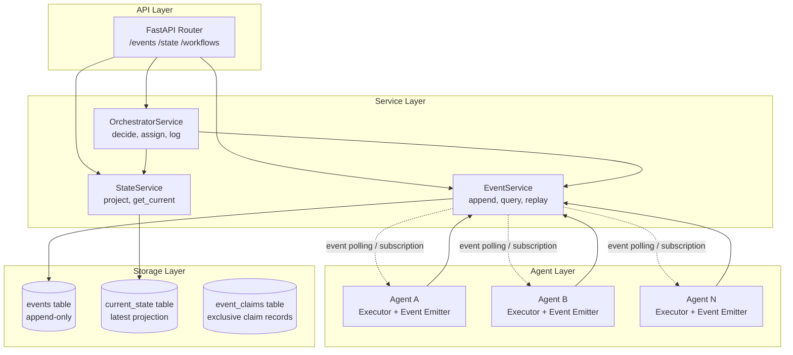
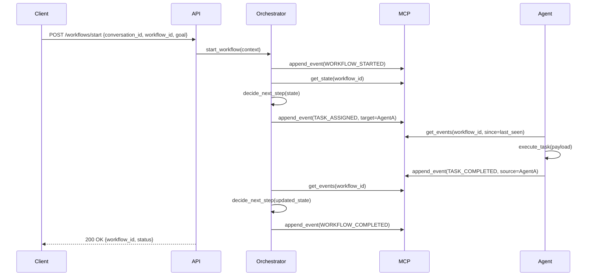
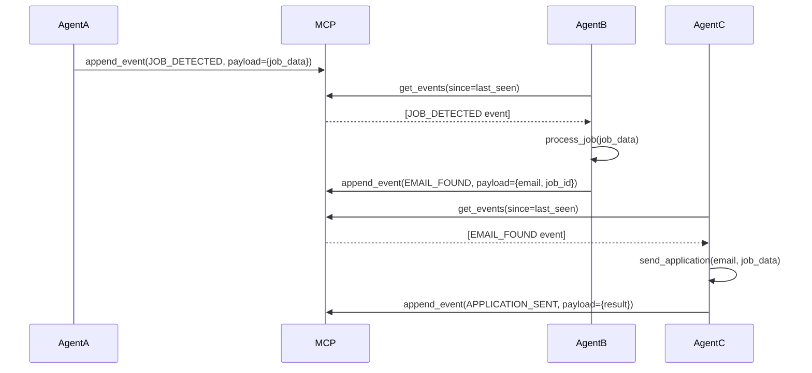
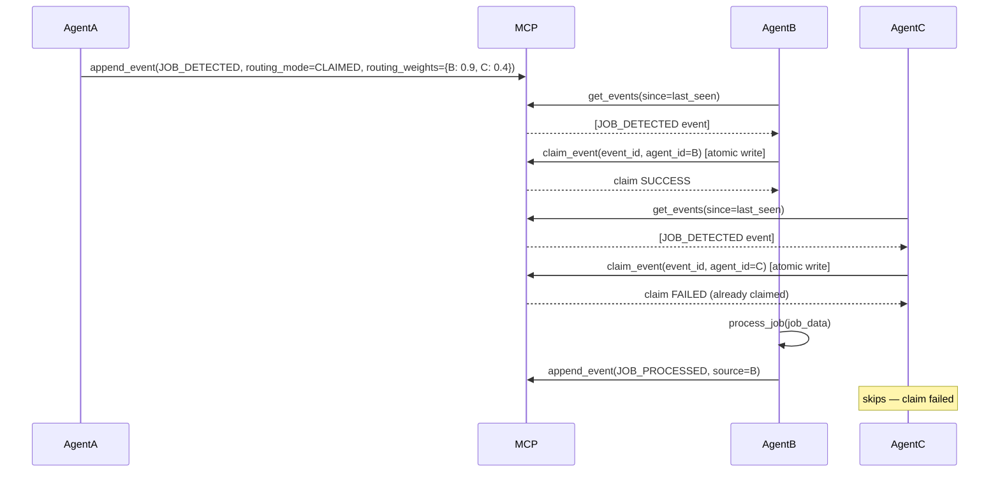

# Design Document: agentmesh

## Overview

agentmesh is a hybrid multi-agent system that combines centralized orchestration with decentralized agent-to-agent (A2A) event-driven collaboration. The system uses MCP (Memory Control Plane) as the single source of truth — an append-only event log and state store — ensuring every action is recorded, all workflows are fully reconstructable, and agents remain loosely coupled.

The architecture separates concerns cleanly: the Orchestrator handles structured workflow control, individual Agents execute tasks and emit events, and MCP provides full observability and replayability without making any decisions itself. Communication between agents is always mediated through events, never through direct calls.

The implementation is structured as a FastAPI service under `mcp/memory-server/src`, with a clean API → Service → Storage layering. All components share `conversation_id` and `workflow_id` as first-class identifiers.

---

## Architecture



---

## Sequence Diagrams

### Orchestrator-Driven Workflow



### A2A Event-Driven Collaboration



### A2A Routing Modes

Events support three routing modes controlled by `routing_mode` on the `Event` model:

**`DIRECTED`** — `target_agent` is set. Only that agent processes the event. No change to existing behavior.

**`FANOUT`** — `target_agent` is `None`. All agents subscribed to the event type react. If `routing_weights` is provided (a dict mapping `agent_id → float`), agents are ranked by weight and only the top-weighted agent(s) react. If no weights are provided, all subscribed agents react (pure fan-out). Weights can encode capability scores, priority, or any metadata the source agent chooses.

**`CLAIMED`** — `target_agent` is `None`, but exclusive processing is required. Before processing, each interested agent must atomically write an `EVENT_CLAIMED` record to MCP (`event_id + agent_id`). The first agent to succeed processes the event; all others skip it. This prevents duplicate processing in competitive fan-out scenarios.



---

## Causation Chain & Loop Prevention

### Building the Causation Chain

Every event carries a `causation_chain: list[UUID]` — an ordered list of all ancestor event IDs from the workflow root down to the immediate parent. When an agent emits a child event in response to an incoming event, it constructs the chain by appending its own `event_id` to the chain it received:

```python
child_event = Event(
    ...
    causation_chain=[*parent_event.causation_chain, parent_event.event_id],
    # e.g. [wf-start-uuid, task-assigned-uuid, job-detected-uuid]
)
```

The root event (e.g. `WORKFLOW_STARTED`) has an empty chain. Each subsequent event in a causal sequence extends it by one entry.

**Example chain for a three-hop A2A flow**:

```
WORKFLOW_STARTED  →  causation_chain: []
TASK_ASSIGNED     →  causation_chain: [wf-start-uuid]
JOB_DETECTED      →  causation_chain: [wf-start-uuid, task-assigned-uuid]
EMAIL_FOUND       →  causation_chain: [wf-start-uuid, task-assigned-uuid, job-detected-uuid]
```

### Loop Detection

Before processing any event, an agent checks whether its own `agent_id` (or more precisely, any `event_id` it previously emitted) already appears in `event.causation_chain`. If it does, the agent is about to re-enter a causal path it already participated in — a cycle.

**Guard rule**: if `agent.agent_id` is found in the chain, the agent must **not** process the event. Instead it emits `TASK_FAILED` with `reason: "recursion_loop_detected"` and skips to the next event.

This is enforced as Guard 4 in the agent event polling loop (see Algorithmic Pseudocode section).

### Workflow Progress Visibility via `processed_event_types` and `pending_event_types`

Two fields on `WorkflowState` give full visibility into where a workflow stands:

- `processed_event_types` — an ordered list of event types that have already been handled. Updated by the state projection algorithm whenever a `TASK_COMPLETED` event is appended (the originating event type is recorded). Agents use this to skip events that have already been acted on.

- `pending_event_types` — the set of event types the orchestrator expects next. Set by the orchestrator when assigning a task. Agents skip any event whose type is not in this list (when the list is non-empty), preventing out-of-order reactions.

Together these two fields make the workflow's progress explicit and machine-checkable, eliminating ambiguity about which steps have run and which are allowed to run next.

---

### MCP (Memory Control Plane)

**Purpose**: Append-only event log and state projection store. The single source of truth. Makes no decisions.

**Interface**:
```python
class MCPInterface(Protocol):
    async def append_event(self, event: Event) -> EventID: ...
    async def get_events(
        self,
        conversation_id: str,
        workflow_id: str,
        since: datetime | None = None,
        event_type: str | None = None,
    ) -> list[Event]: ...
    async def get_state(self, workflow_id: str) -> WorkflowState: ...
    async def try_claim_event(self, event_id: UUID, agent_id: str) -> bool:
        """
        Atomically insert a record into event_claims(event_id, agent_id).
        Returns True if this agent successfully claimed the event (first writer wins).
        Returns False if another agent already holds the claim.
        Implemented via INSERT ... ON CONFLICT DO NOTHING + row count check.
        """
        ...
```

**Responsibilities**:
- Persist every event atomically
- Project current state from event history
- Provide filtered event queries for agents and orchestrator
- Never modify or delete events

---

### Orchestrator

**Purpose**: Reads MCP state, decides workflow steps, assigns tasks to agents, logs all decisions.

**Interface**:
```python
class OrchestratorInterface(Protocol):
    async def start_workflow(self, context: WorkflowContext) -> WorkflowID: ...
    async def decide_next_step(self, state: WorkflowState) -> WorkflowDecision: ...
    async def assign_task(self, agent_id: str, task: Task) -> None: ...
    async def on_event(self, event: Event) -> None: ...
```

**Responsibilities**:
- Emit `WORKFLOW_STARTED` and `WORKFLOW_COMPLETED` events
- Read state from MCP before every decision
- Emit `TASK_ASSIGNED` events (never call agents directly)
- Log every decision as an event

---

### Agent

**Purpose**: Executes tasks independently, reacts to relevant events, logs all outputs.

**Interface**:
```python
class AgentInterface(Protocol):
    agent_id: str
    subscribed_event_types: list[str]

    async def execute(self, task: Task) -> TaskResult: ...
    async def on_event(self, event: Event) -> None: ...
    async def emit_event(self, event_type: str, payload: dict) -> None: ...
```

**Responsibilities**:
- Poll or subscribe to MCP for relevant events
- Execute tasks and emit result events
- Never call other agents directly
- Maintain no hidden state outside MCP

---

### EventService

**Purpose**: Core service layer for event persistence and querying.

**Interface**:
```python
class EventService:
    async def append(self, event: Event) -> EventID: ...
    async def query(self, filters: EventFilters) -> list[Event]: ...
    async def replay(self, workflow_id: str) -> list[Event]: ...
```

---

### StateService

**Purpose**: Manages current state projections derived from the event log.

**Interface**:
```python
class StateService:
    async def project(self, events: list[Event]) -> WorkflowState: ...
    async def get_current(self, workflow_id: str) -> WorkflowState: ...
    async def invalidate(self, workflow_id: str) -> None: ...
```

---

## Data Models

### Event

```python
from dataclasses import dataclass, field
from datetime import datetime
from uuid import UUID, uuid4

@dataclass
class Event:
    conversation_id: str
    workflow_id: str
    event_type: str          # e.g. TASK_ASSIGNED, JOB_DETECTED
    source_agent: str        # agent or orchestrator that emitted this
    payload: dict
    timestamp: datetime = field(default_factory=datetime.utcnow)
    event_id: UUID = field(default_factory=uuid4)
    target_agent: str | None = None                    # optional: for directed events
    routing_weights: dict[str, float] | None = None    # optional: agent_id → weight for weighted fan-out
    routing_mode: str = "DIRECTED"                     # DIRECTED | FANOUT | CLAIMED
    causation_chain: list[UUID] = field(default_factory=list)
    # Ordered list of ancestor event IDs from workflow root to immediate parent.
    # e.g. [root_event_id, ..., grandparent_id, parent_id]
    # The emitting agent appends its own event_id when creating child events.
```

**Validation Rules**:
- `conversation_id`, `workflow_id`, `event_type`, `source_agent` must be non-empty strings
- `payload` must be a serializable dict
- `timestamp` must be UTC
- `event_id` must be globally unique
- `routing_mode` must be one of `DIRECTED`, `FANOUT`, or `CLAIMED`
- `routing_weights` is only meaningful when `routing_mode` is `FANOUT` or `CLAIMED`; keys must be valid agent IDs and values must be non-negative floats
- When `target_agent` is set, `routing_mode` is implicitly `DIRECTED` regardless of the field value
- `causation_chain` entries must be valid UUIDs; the chain must not contain the emitting agent's own `event_id` (loop guard)

---

### WorkflowState

```python
@dataclass
class WorkflowState:
    workflow_id: str
    conversation_id: str
    status: str              # PENDING | RUNNING | COMPLETED | FAILED
    current_step: str | None
    assigned_agents: list[str]
    last_event_id: UUID | None
    updated_at: datetime
    metadata: dict = field(default_factory=dict)
    processed_event_types: list[str] = field(default_factory=list)
    # Ordered list of event_types that have already been handled in this workflow
    pending_event_types: list[str] = field(default_factory=list)
    # Event types expected/allowed next — set by orchestrator when assigning tasks
```

---

### Task

```python
@dataclass
class Task:
    task_id: UUID
    workflow_id: str
    conversation_id: str
    agent_id: str
    task_type: str
    payload: dict
    created_at: datetime = field(default_factory=datetime.utcnow)
```

---

### WorkflowContext

```python
@dataclass
class WorkflowContext:
    conversation_id: str
    workflow_id: str
    goal: str
    initial_payload: dict
    created_at: datetime = field(default_factory=datetime.utcnow)
```

---

### EventFilters

```python
@dataclass
class EventFilters:
    conversation_id: str | None = None
    workflow_id: str | None = None
    event_type: str | None = None
    source_agent: str | None = None
    target_agent: str | None = None
    since: datetime | None = None
    limit: int = 100
```

---

## Event Type Registry

### System Events (Orchestrator-driven)

| Event Type | Source | Description |
|---|---|---|
| `WORKFLOW_STARTED` | orchestrator | A new workflow has begun |
| `WORKFLOW_COMPLETED` | orchestrator | Workflow finished successfully |
| `WORKFLOW_FAILED` | orchestrator | Workflow terminated with error |
| `TASK_ASSIGNED` | orchestrator | Task assigned to a specific agent |
| `TASK_CANCELLED` | orchestrator | Previously assigned task cancelled |

### Agent Events (A2A)

| Event Type | Source | Description |
|---|---|---|
| `TASK_COMPLETED` | agent | Agent finished its assigned task |
| `TASK_FAILED` | agent | Agent failed to complete task |
| `JOB_DETECTED` | agent | Job opportunity found |
| `EMAIL_FOUND` | agent | Contact email discovered |
| `APPLICATION_SENT` | agent | Job application submitted |

### Infrastructure Events

| Event Type | Source | Description |
|---|---|---|
| `EVENT_CLAIMED` | agent | Agent atomically claimed an event for exclusive processing (used with `routing_mode=CLAIMED`) |

---

## Algorithmic Pseudocode

### Main Orchestration Loop

```python
async def run_orchestration_loop(
    workflow_id: str,
    mcp: MCPInterface,
    decision_engine: DecisionEngine,
) -> None:
    """
    Preconditions:
      - workflow_id is a valid, existing workflow
      - WORKFLOW_STARTED event already appended
      - mcp is connected and available

    Postconditions:
      - Either WORKFLOW_COMPLETED or WORKFLOW_FAILED is appended
      - Every decision is recorded as an event
      - No hidden state exists outside MCP

    Loop Invariant:
      - state reflects all events appended so far
      - Every iteration reads fresh state from MCP
    """
    while True:
        # Always read fresh state — no local caching
        state = await mcp.get_state(workflow_id)

        if state.status in ("COMPLETED", "FAILED"):
            break

        decision = decision_engine.decide(state)

        if decision.action == "ASSIGN_TASK":
            event = Event(
                workflow_id=workflow_id,
                conversation_id=state.conversation_id,
                event_type="TASK_ASSIGNED",
                source_agent="orchestrator",
                target_agent=decision.agent_id,
                payload=decision.task_payload,
            )
            await mcp.append_event(event)

        elif decision.action == "COMPLETE":
            await mcp.append_event(Event(
                workflow_id=workflow_id,
                conversation_id=state.conversation_id,
                event_type="WORKFLOW_COMPLETED",
                source_agent="orchestrator",
                payload={"summary": decision.summary},
            ))
            break

        elif decision.action == "FAIL":
            await mcp.append_event(Event(
                workflow_id=workflow_id,
                conversation_id=state.conversation_id,
                event_type="WORKFLOW_FAILED",
                source_agent="orchestrator",
                payload={"reason": decision.reason},
            ))
            break

        await asyncio.sleep(POLL_INTERVAL)
```

---

### Agent Event Polling Loop

```python
async def agent_event_loop(
    agent: AgentInterface,
    mcp: MCPInterface,
    workflow_id: str,
) -> None:
    """
    Preconditions:
      - agent.subscribed_event_types is non-empty
      - mcp is connected and available

    Postconditions:
      - Every relevant event triggers agent.on_event()
      - Agent emits result events back to MCP (never calls peers directly)

    Loop Invariant:
      - last_seen advances monotonically
      - No event is processed twice
    """
    last_seen: datetime | None = None

    while True:
        events = await mcp.get_events(
            workflow_id=workflow_id,
            since=last_seen,
        )

        for event in events:
            if event.event_type not in agent.subscribed_event_types:
                last_seen = event.timestamp
                continue

            # --- Guard 1: Fetch current workflow state ---
            state = await mcp.get_state(workflow_id)

            # --- Guard 2: Skip if event type already processed in this workflow ---
            if event.event_type in state.processed_event_types:
                last_seen = event.timestamp
                continue

            # --- Guard 3: Skip if event type is not expected at this workflow step ---
            if state.pending_event_types and event.event_type not in state.pending_event_types:
                last_seen = event.timestamp
                continue

            # --- Guard 4: Abort if this agent is already in the causation chain (loop detection) ---
            if agent.agent_id in [str(uid) for uid in event.causation_chain]:
                await agent.emit_event(
                    event_type="TASK_FAILED",
                    payload={"reason": "recursion_loop_detected", "event_id": str(event.event_id)},
                )
                last_seen = event.timestamp
                continue

            routing_mode = event.routing_mode or "DIRECTED"

            # --- DIRECTED: only the named target processes this event ---
            if event.target_agent is not None:
                if event.target_agent == agent.agent_id:
                    await agent.on_event(event)

            # --- FANOUT: all (or weighted-top) subscribers react ---
            elif routing_mode == "FANOUT":
                if event.routing_weights:
                    # Only react if this agent is the highest-weighted subscriber
                    my_weight = event.routing_weights.get(agent.agent_id, 0.0)
                    max_weight = max(event.routing_weights.values())
                    if my_weight >= max_weight:
                        await agent.on_event(event)
                else:
                    # Pure fan-out — all subscribed agents react
                    await agent.on_event(event)

            # --- CLAIMED: first agent to atomically claim the event wins ---
            elif routing_mode == "CLAIMED":
                claimed = await mcp.try_claim_event(
                    event_id=event.event_id,
                    agent_id=agent.agent_id,
                )
                if claimed:
                    await agent.on_event(event)
                # else: another agent already claimed it — skip silently

            last_seen = event.timestamp

        await asyncio.sleep(POLL_INTERVAL)
```

---

### State Projection Algorithm

```python
def project_state(events: list[Event], initial: WorkflowState) -> WorkflowState:
    """
    Preconditions:
      - events is ordered by timestamp ascending
      - initial is a valid WorkflowState with status=PENDING

    Postconditions:
      - Returned state reflects all events applied in order
      - state.status is one of: PENDING, RUNNING, COMPLETED, FAILED
      - state.last_event_id equals the last event's event_id

    Loop Invariant:
      - state is a valid projection of all events processed so far
    """
    state = initial

    for event in events:
        if event.event_type == "WORKFLOW_STARTED":
            state = replace(state, status="RUNNING", updated_at=event.timestamp)

        elif event.event_type == "TASK_ASSIGNED":
            agent = event.target_agent
            if agent and agent not in state.assigned_agents:
                state = replace(
                    state,
                    assigned_agents=[*state.assigned_agents, agent],
                    current_step=event.payload.get("task_type"),
                    updated_at=event.timestamp,
                )

        elif event.event_type == "TASK_COMPLETED":
            # Track the originating event type as processed
            originating_type = event.payload.get("originating_event_type")
            if originating_type and originating_type not in state.processed_event_types:
                state = replace(
                    state,
                    processed_event_types=[*state.processed_event_types, originating_type],
                    updated_at=event.timestamp,
                )

        elif event.event_type == "WORKFLOW_COMPLETED":
            state = replace(state, status="COMPLETED", updated_at=event.timestamp)

        elif event.event_type == "WORKFLOW_FAILED":
            state = replace(state, status="FAILED", updated_at=event.timestamp)

        state = replace(state, last_event_id=event.event_id)

    return state
```

---

## Key Functions with Formal Specifications

### `append_event(event: Event) -> EventID`

**Preconditions**:
- `event.conversation_id` is non-empty
- `event.workflow_id` is non-empty
- `event.event_type` is a registered event type
- `event.source_agent` is non-empty
- `event.payload` is JSON-serializable

**Postconditions**:
- Event is durably persisted in the `events` table
- Returned `EventID` uniquely identifies the stored event
- `get_events(workflow_id)` will include this event in subsequent calls
- No existing events are modified

---

### `get_state(workflow_id: str) -> WorkflowState`

**Preconditions**:
- `workflow_id` is non-empty
- At least one event with this `workflow_id` exists

**Postconditions**:
- Returned state is the projection of all events for `workflow_id`
- `state.last_event_id` matches the most recent event's ID
- State is consistent with the append-only event log

---

### `decide_next_step(state: WorkflowState) -> WorkflowDecision`

**Preconditions**:
- `state.status == "RUNNING"`
- `state.workflow_id` is non-empty

**Postconditions**:
- Returns one of: `ASSIGN_TASK`, `COMPLETE`, `FAIL`
- If `ASSIGN_TASK`: `decision.agent_id` and `decision.task_payload` are populated
- Decision is deterministic given the same state
- No side effects (pure function)

---

## Example Usage

```python
import asyncio
from agentmesh.mcp import MCPClient
from agentmesh.orchestrator import Orchestrator
from agentmesh.agents import JobDetectorAgent, EmailFinderAgent, ApplicationAgent

async def main():
    mcp = MCPClient(db_url="postgresql://localhost/agentmesh")

    # Start a workflow
    context = WorkflowContext(
        conversation_id="conv-001",
        workflow_id="wf-job-search-001",
        goal="find_and_apply_to_jobs",
        initial_payload={"keywords": ["Python", "backend"], "location": "remote"},
    )

    orchestrator = Orchestrator(mcp=mcp)
    await orchestrator.start_workflow(context)

    # Agents run independently, polling MCP for events
    agents = [
        JobDetectorAgent(agent_id="job-detector", mcp=mcp),
        EmailFinderAgent(agent_id="email-finder", mcp=mcp),
        ApplicationAgent(agent_id="applicator", mcp=mcp),
    ]

    await asyncio.gather(
        orchestrator.run(workflow_id=context.workflow_id),
        *[agent.run(workflow_id=context.workflow_id) for agent in agents],
    )

# Replay full workflow history
async def replay_workflow(workflow_id: str):
    mcp = MCPClient(db_url="postgresql://localhost/agentmesh")
    events = await mcp.get_events(workflow_id=workflow_id)
    for event in events:
        print(f"[{event.timestamp}] {event.source_agent} → {event.event_type}: {event.payload}")
```

---

## Correctness Properties

```python
# Property 1: Events are append-only — no event is ever modified or deleted
# ∀ event_id: once stored, get_events() always returns the same event for that ID

# Property 2: State is fully reconstructable from events
# ∀ workflow_id: project_state(get_events(workflow_id)) == get_state(workflow_id)

# Property 3: No agent calls another agent directly
# ∀ agent A, agent B: A communicates with B only via MCP events

# Property 4: Every action produces an event
# ∀ orchestrator decision d: ∃ event e where e.source_agent == "orchestrator" and e reflects d

# Property 5: conversation_id and workflow_id are present on every event
# ∀ event e: e.conversation_id ≠ "" ∧ e.workflow_id ≠ ""

# Property 6: State projection is deterministic
# ∀ event_list L: project_state(L) always produces the same result

# Property 7: Agents only react to events they subscribe to
# ∀ agent A, event e: A.on_event(e) is called only if e.event_type ∈ A.subscribed_event_types

# Property 8: Claim exclusivity — at most one agent processes a CLAIMED event
# ∀ event e where e.routing_mode == "CLAIMED":
#   ∃ at most one agent A such that try_claim_event(e.event_id, A.agent_id) returns True
#   (guaranteed by atomic write + unique constraint on event_claims(event_id))

# Property 9: No recursion loops
# ∀ event e, agent A: if A.agent_id appears in e.causation_chain, A must not process e

# Property 10: Workflow step ordering is enforced
# ∀ agent A, event e: A only reacts if e.event_type ∈ state.pending_event_types (when pending list is non-empty)
```

---

## Error Handling

### Scenario 1: Agent Fails to Complete Task

**Condition**: Agent raises an exception or times out during `execute()`
**Response**: Agent catches the error and emits `TASK_FAILED` event with error details in payload
**Recovery**: Orchestrator reads `TASK_FAILED` event, decides whether to retry, reassign, or fail the workflow

### Scenario 2: MCP Unavailable

**Condition**: Database connection lost during `append_event()` or `get_events()`
**Response**: Raise `MCPUnavailableError`; caller retries with exponential backoff
**Recovery**: Once MCP is restored, agents and orchestrator resume from last known `last_seen` timestamp — no events are lost

### Scenario 3: Duplicate Event Submission

**Condition**: Network retry causes the same event to be submitted twice
**Response**: `event_id` (UUID) is used as idempotency key; duplicate inserts are ignored
**Recovery**: Transparent to callers — `append_event()` returns the existing `EventID`

### Scenario 4: Invalid Event Schema

**Condition**: Agent emits event with missing required fields
**Response**: `EventService.append()` raises `EventValidationError` before any DB write
**Recovery**: Agent catches validation error, logs it, and emits `TASK_FAILED` instead

---

## Testing Strategy

### Unit Testing Approach

Each service is tested in isolation with a mock MCP backend:
- `EventService`: test append, query filtering, idempotency
- `StateService`: test projection correctness for all event type transitions
- `OrchestratorService`: test decision logic for each state combination
- Individual agents: test `on_event()` handlers and `execute()` logic

### Property-Based Testing Approach

**Property Test Library**: `hypothesis`

Key properties to test:
- Any sequence of valid events produces a valid `WorkflowState`
- `project_state(events)` is idempotent — applying the same events twice yields the same result
- Appending events never changes previously stored events
- `get_state()` always equals `project_state(get_events())`
- Events with missing required fields always fail validation

### Integration Testing Approach

End-to-end tests spin up a real database and run full workflows:
- Orchestrator assigns tasks → agents pick them up → workflow completes
- A2A scenario: Agent A emits event → Agent B reacts → Agent C reacts
- Replay test: record all events, replay them, verify final state matches

---

## Performance Considerations

- The `events` table is append-only and indexed on `(workflow_id, timestamp)` for efficient range queries
- `current_state` table caches the latest projection to avoid full replays on every `get_state()` call
- `event_claims` table has a unique constraint on `event_id` and is indexed on `(event_id, agent_id)`; atomic inserts use `INSERT ... ON CONFLICT DO NOTHING` to guarantee claim exclusivity without application-level locking
- Agents use timestamp-based polling (`since=last_seen`) to avoid re-processing old events
- For high-throughput scenarios, event subscriptions can be replaced with a message broker (e.g., Redis Streams) without changing agent interfaces

---

## Security Considerations

- `conversation_id` and `workflow_id` must be validated as non-guessable UUIDs to prevent cross-workflow data leakage
- The MCP API layer enforces that agents can only append events for their own `source_agent` identity
- Event payloads must be sanitized before storage to prevent injection attacks
- All API endpoints require authentication; agents authenticate with per-agent API keys

---

## Project Structure

```
mcp/
└── memory-server/
    └── src/
        ├── api/
        │   ├── __init__.py
        │   ├── routes/
        │   │   ├── events.py       # POST /events, GET /events
        │   │   ├── state.py        # GET /state/{workflow_id}
        │   │   └── workflows.py    # POST /workflows/start
        │   └── dependencies.py     # FastAPI dependency injection
        ├── services/
        │   ├── event_service.py    # EventService
        │   ├── state_service.py    # StateService
        │   └── orchestrator_service.py  # OrchestratorService
        ├── storage/
        │   ├── models.py           # SQLAlchemy ORM models (events, current_state, event_claims)
        │   ├── repository.py       # DB access layer
        │   └── migrations/         # Alembic migrations
        ├── agents/
        │   ├── base.py             # AgentInterface base class
        │   ├── job_detector.py
        │   ├── email_finder.py
        │   └── applicator.py
        ├── core/
        │   ├── models.py           # Event, WorkflowState, Task dataclasses
        │   ├── event_types.py      # Event type registry constants
        │   └── exceptions.py       # MCPUnavailableError, EventValidationError
        └── main.py                 # FastAPI app entrypoint
```

---

## Dependencies

| Dependency | Purpose |
|---|---|
| `fastapi` | API layer |
| `uvicorn` | ASGI server |
| `sqlalchemy` | ORM and DB access |
| `alembic` | Database migrations |
| `asyncpg` | Async PostgreSQL driver |
| `pydantic` | Request/response validation |
| `hypothesis` | Property-based testing |
| `pytest-asyncio` | Async test support |
| `uuid` | Event ID generation (stdlib) |
