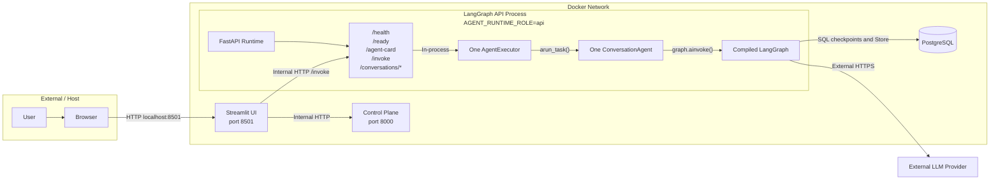
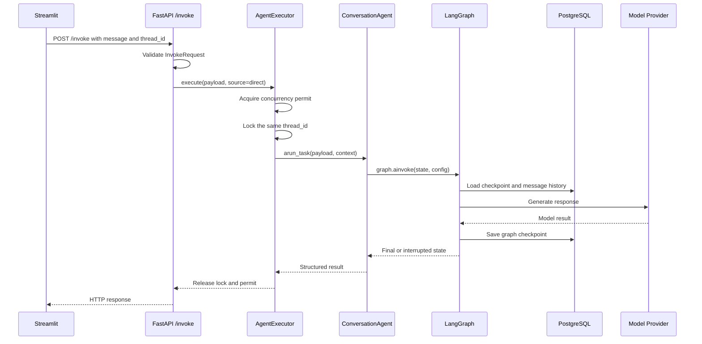
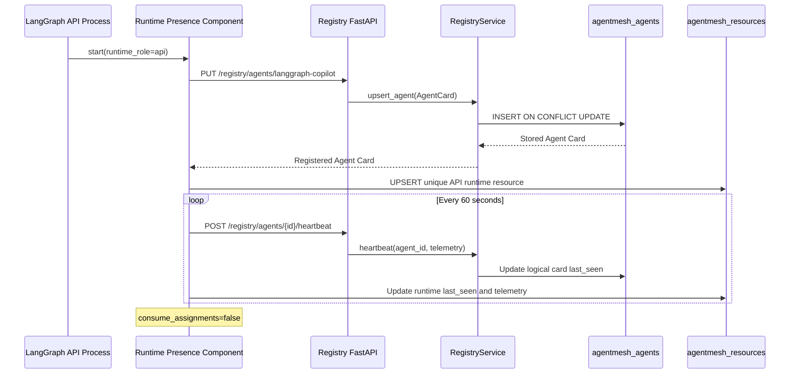
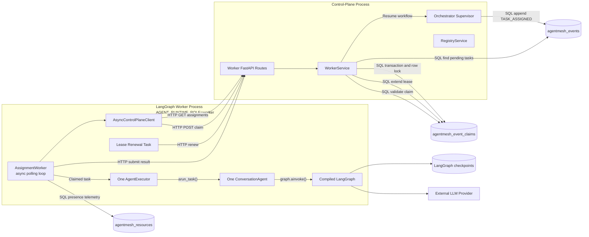
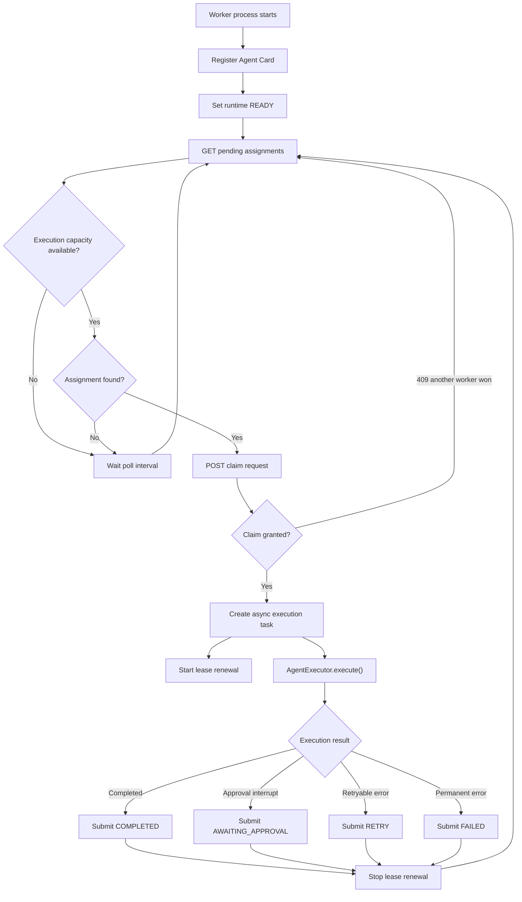
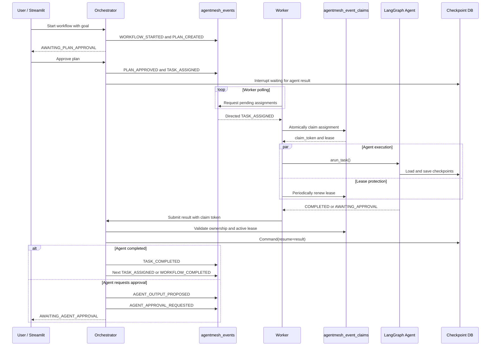
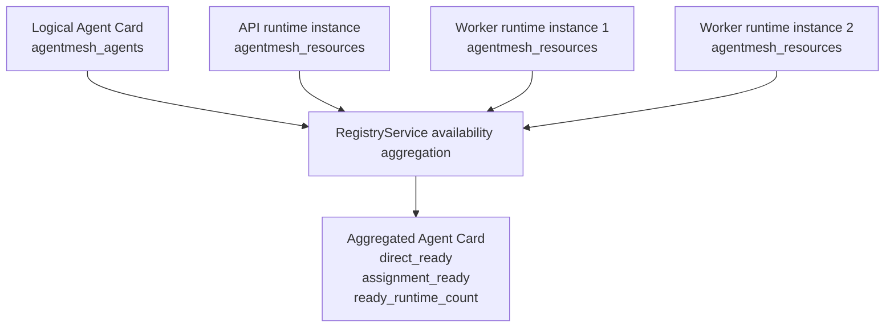
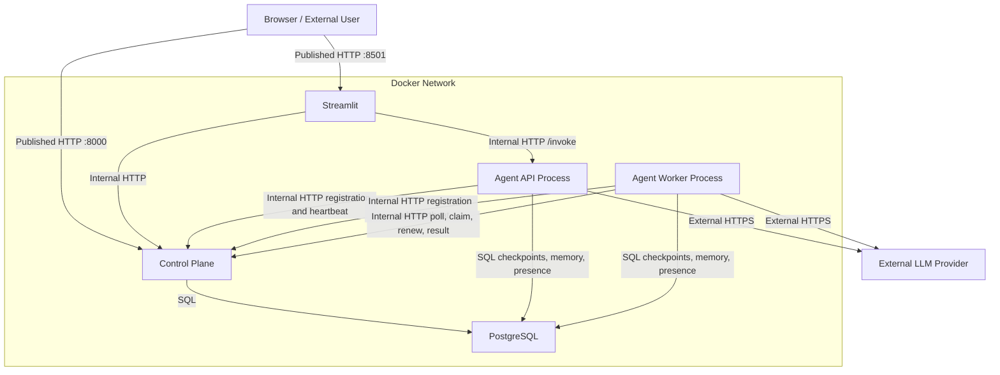

# Agent Runtime, API, Worker, and Registry Guide

This document explains the current AgentMesh V1 runtime. It focuses on how the
LangGraph agent is started, how API and worker profiles deliver work to the same
execution contract, how the registry tracks logical agents and running instances,
and how PostgreSQL coordinates durable workflows and assignment claims.

## Core Principle

API and worker modes are inbound interfaces around the same agent execution path:

```text
FastAPI /invoke ---------+
                         +--> AgentExecutor --> BaseAgent.arun_task() --> LangGraph
Assignment worker -------+
```

Communication types used in the diagrams:

- **In-process Python call:** communication between objects in one process.
- **Internal HTTP:** communication between containers on the Docker network.
- **SQL:** durable state and coordination through PostgreSQL.
- **External HTTPS:** communication with an LLM provider.

## API Profile

The API profile exposes direct invocation and conversation endpoints. It registers
and sends presence heartbeats, but it does not poll for queued assignments.



In the split profile, the API service does not currently publish port `8101` to
the host. Streamlit reaches it through the Docker network by using the endpoint
published in the Agent Card. Combined mode publishes `8101` for convenient direct
local testing.

### Direct Invocation



The registry is used to discover the direct endpoint and verify readiness. It is
not called for every graph node or model request.

## API Profile Registration

The runtime currently uses `AssignmentWorker` for both presence and assignment
consumption. In API mode it performs only the presence responsibilities.



API mode provides:

- registration and heartbeat
- health and readiness
- Agent Card discovery
- direct invocation and conversation endpoints
- no assignment polling

## Worker Profile

Worker mode registers itself, polls the control plane for directed assignments,
claims work through PostgreSQL leases, executes the same agent contract, and
submits a claim-authenticated result. It deliberately has no `/invoke` route.



## Polling Loop

Polling means that the worker asks the control plane for available work at a
configured interval. It is different from the executor's concurrency pool limit.



With `POLL_INTERVAL_SECONDS=2`, an idle worker waits approximately two seconds
before asking again. It does not claim additional work after reaching its process
concurrency limit.

## Assignment Claim

Finding an assignment does not grant ownership. The worker must claim it:

```text
Worker Python code
    --> HTTP POST /workers/{agent_id}/assignments/{event_id}/claim
    --> FastAPI worker route
    --> WorkerService.claim_assignment()
    --> PostgresClaimRepository.try_claim()
    --> SQL transaction in agentmesh_event_claims
```

PostgreSQL locks the claim row with `SELECT ... FOR UPDATE`. The claim is granted
only when the assignment is not completed, dead-lettered, waiting for a scheduled
retry, or protected by an unexpired lease.

The stored claim includes:

- assignment event ID
- agent ID and worker-process ID
- unique claim token
- claim and lease timestamps
- attempt and maximum-attempt counts
- idempotency key

If two worker replicas race for the same assignment, PostgreSQL grants one claim.
The other receives HTTP `409 Conflict` and continues polling.

## Workflow Execution



## Registry Model

The registry separates stable identity from process presence:



`agentmesh_agents` contains one row per logical agent. `agentmesh_resources`
contains one row per running process instance. The registry computes:

- `direct_ready`: a ready `api` or `combined` instance exists
- `assignment_ready`: a ready `worker` or `combined` instance exists
- `direct_endpoint`: the most recently seen direct-capable endpoint
- `ready_runtime_count`: number of fresh, ready runtime instances

Runtime instances older than the stale threshold are marked `stale`. Normal
heartbeats update presence without creating an audit event; lifecycle transitions
such as registration, degradation, recovery, draining, and shutdown are audited.

## Infrastructure Communication



## Responsibility Boundaries

### Registry Service

- stores and discovers Agent Cards
- tracks and aggregates runtime-instance availability
- finds assignment-ready agents by capability
- marks stale runtime processes
- does not execute agents or claim tasks

### Worker Service

- lists pending directed assignments
- grants and renews claim leases
- validates claim-authenticated results
- schedules retries and dead-letters exhausted assignments
- resumes the orchestrator with completed worker results

### Agent Executor

- provides process-level concurrency limits
- serializes executions sharing a thread ID
- tracks active executions
- drains safely during shutdown
- invokes `BaseAgent.arun_task(payload, context)`

### LangGraph Agent

- owns reasoning and graph state
- reads and writes durable checkpoints
- communicates with the model provider
- returns structured completed, rejected, or interrupted results
- does not know whether work arrived through API or worker polling

## V2 Direction

V1 uses `AGENT_RUNTIME_ROLE=combined|api|worker`. The future composable-interface
proposal is documented in [FUTURE_PROPOSALS.md](FUTURE_PROPOSALS.md). It replaces
compound roles with settings such as `AGENT_INTERFACES=api,worker,mcp` while keeping
the shared executor and concrete agent unchanged.
