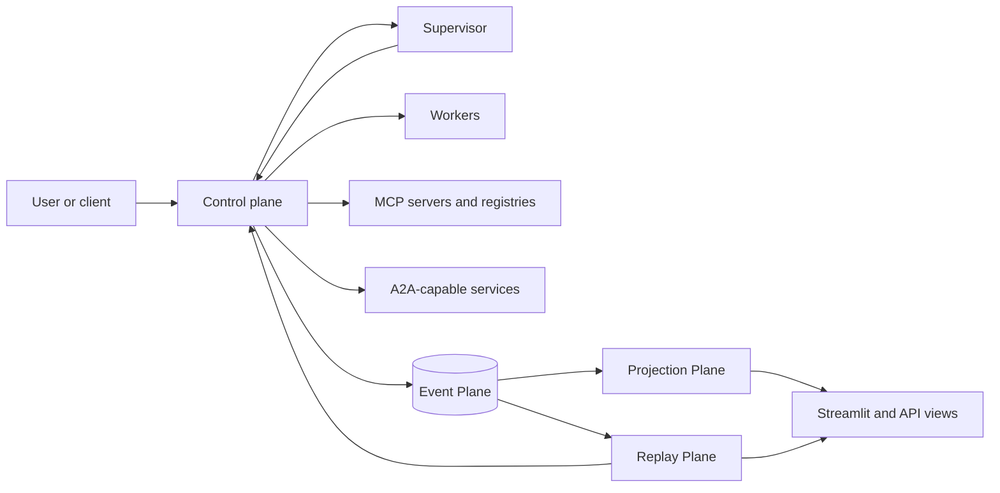
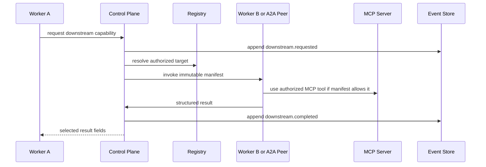

# RFC-001: Intent-Driven Three-Plane Runtime

Status: Draft v0.1  
Owner: AgentMesh maintainers  
Scope: Runtime architecture, durable workflow state, replay/recovery, and future
agent-to-agent/tool lineage  
Authoritative baseline: `plan.md`

## 1. Summary

AgentMesh is moving toward an intent-driven execution platform, not only a
multi-agent demo. The runtime should accept a user goal, let a supervisor plan
the intended work, execute that work through controlled agents and tools, record
what actually happened, expose a live state that humans can understand, and
recover or branch from well-defined checkpoints.

This RFC gives that platform a simple mental model:

```text
History is immutable.
Current state is rebuildable.
Future execution is branchable.
```

The architecture is organized into three planes:

- Event Plane: what actually happened.
- Projection Plane: what we believe is happening now, and how it compares with
  the intended plan.
- Replay Plane: what can be inspected, retried, resumed, or branched without
  rewriting history.

The existing control-plane/supervisor/worker boundaries remain unchanged. This
RFC names the planes and lineage model that make those boundaries easier to
implement, explain, test, and extend.

## 2. Non-Goals

This RFC does not introduce runtime code, database migrations, authentication,
or a public hosted deployment. It is an architecture milestone that should guide
future implementation tasks and ADRs.

It also does not allow agents to call each other directly. Future A2A and MCP
hops remain mediated by the control plane, event store, authorization checks,
and input manifests.

## 3. Design Questions

The whole runtime can be explained through four questions:

| Question | Runtime concept | Owner |
| --- | --- | --- |
| What do we want? | Intent model and plan version | Supervisor proposes, control plane validates |
| What happened? | Append-only event stream | Control plane |
| Who caused whom to act? | Execution lineage tree | Control plane projection from events |
| Where are we now? | Current-state projections | Control plane projection from events |

The event stream is the durable source of truth. The plan, execution tree, and
live views are structured interpretations built around that truth.

## 4. Plane Overview



The control plane is the crossing point between planes. It accepts requests,
validates plans, dispatches work, appends events, updates retry state, records
checkpoint mappings, and publishes projections.

The supervisor reasons about intent, plan quality, semantic validation,
replanning, and final summaries. It may inspect authorized workflow outputs, but
it does not own durable queues or bypass the control plane.

Workers execute immutable manifests. They do not select recipients, mutate the
DAG, browse workflow history, or call other agents directly.

## 5. Event Plane

The Event Plane answers: "What actually happened?"

It is append-only. A later correction, retry, replan, approval, or cancellation
is represented by another event, never by editing the original fact.

Events begin at request acceptance and continue through planning, validation,
worker dispatch, tool calls, retries, checkpoint reviews, approvals, summaries,
and terminal results.

### 5.1 Event Invariant

Every durable state transition must append an event inside the same reliability
boundary as its state change, or be reconciled by a documented recovery process.

Events are not a debug log. Debug logs explain process behavior. Events record
workflow facts that can rebuild state.

### 5.2 Event Envelope

The event envelope should remain close to the contract in `plan.md`:

```json
{
  "event_id": "evt_...",
  "workflow_id": "wf_...",
  "plan_version": 3,
  "event_type": "task.completed",
  "source": {"type": "worker", "id": "resume-tailor"},
  "destination": {"type": "control_plane", "id": "runtime"},
  "causation_id": "evt_...",
  "correlation_id": "wf_...",
  "checkpoint_id": "cp_...",
  "classification": "supervisor_only",
  "payload": {}
}
```

`causation_id` links a fact to the event that caused it. `correlation_id` keeps
all related work under the same workflow/request identity. `checkpoint_id` links
event history to a resumable execution snapshot when one exists.

### 5.3 Event Types

The current `plan.md` event names remain the contract. Future implementation
should add explicit immutable retry/dead-letter events where retry state is now
only visible through mutable claim rows:

- `task.retry_scheduled`
- `task.dead_lettered`
- `supervisor_action.retry_scheduled`
- `supervisor_action.dead_lettered`

These events make retries visible to users and replayable projections without
turning the claim table into the historical record.

## 6. Projection Plane

The Projection Plane answers: "Where are we now?"

It folds events into user-facing and operator-facing views. A projection may be
stored for speed, but it must be rebuildable from events and plan versions.

### 6.1 Core Projections

AgentMesh should maintain these read models:

| Projection | Purpose |
| --- | --- |
| Workflow summary | Overall status, latest plan version, final result, blockers |
| Step status | Proposed, queued, running, retrying, blocked, validated, failed |
| Event timeline | Newest-first or cursor-based facts for inspection |
| Checkpoint list | Recoverable and terminal checkpoints |
| Execution tree | Parent-child causation across supervisor, workers, MCP, and A2A |
| Approval view | Pending decisions with risk context and expiry |
| Failure view | Retry state, dead letters, semantic failures, recovery options |

The UI should show projections as live operating views, not as independent
truth. If a projection and the event stream disagree, the event stream wins and
the projection is rebuilt.

### 6.2 Plan Versus Projection

The plan is desired state. The projection is observed state.

The supervisor proposes a plan with steps, dependencies, bindings, visibility,
validation policy, and checkpoint policy. The control plane validates the plan
and then projects execution progress from events.

This separation matters because a plan may say "run role research, then resume
tailoring, then QA," while the projection may show "role research is retrying
after a provider 429." The projection is not a replacement for the plan; it is
the runtime's current reading of what actually happened against that plan.

## 7. Replay Plane

The Replay Plane answers: "What can we safely do again?"

Replay never rewrites source history. It either rebuilds state read-only or
creates a linked child workflow with a new execution lineage.

### 7.1 Replay Modes

| Mode | Side effects | Output |
| --- | --- | --- |
| Read-only replay | None | Rebuilt projection from events |
| Diagnostic fork | Controlled and usually non-mutating | New diagnostic branch |
| Executable recovery | Yes, from a selected checkpoint onward | Linked child workflow |
| Rerun | Yes, from a fresh supervisor plan | New child workflow |

Read-only replay must not call workers, models, browsers, MCP servers, or
external APIs. It only re-folds stored events.

Executable recovery starts from a non-terminal checkpoint. It copies the
checkpoint values into a new workflow identity, records the parent workflow and
checkpoint, and resumes only the continuation that is still executable.

### 7.2 Retry Versus Replay

Retry is a control-plane concern for the same assignment or supervisor action.
It preserves the original assignment identity and idempotency key while creating
new attempts and claim tokens.

Replay and recovery create a new lineage. They are used when the user or runtime
needs to inspect, branch, or continue from a checkpoint rather than merely retry
a transient failure.

### 7.3 Checkpoint Rules

Checkpoints should be created after request acceptance, plan acceptance,
dispatch, result persistence, validation decisions, user input, approvals,
replans, and terminal results.

A terminal checkpoint is inspectable but not executable. Recovery from a terminal
checkpoint should be rejected before child events are written.

## 8. Execution Lineage Tree

The execution tree answers: "Who asked whom to do what?"

The event timeline is chronological. The execution tree is causal.

Example timeline:

```text
1. workflow.created
2. plan.accepted
3. task.assigned role-research
4. mcp.call.started search
5. mcp.call.completed search
6. task.completed role-research
7. task.assigned resume-tailor
```

Example lineage:

```text
workflow wf_123
`-- supervisor planning action
    |-- worker role-research
    |   `-- MCP search call
    `-- worker resume-tailor
```

The lineage tree is derived from `causation_id`, parent request IDs, plan step
IDs, and trace context. It lets operators see nested agent/tool chains without
confusing chronology with causality.

### 8.1 Why The Tree Matters

The tree enables surgical recovery. If an MCP call fails under one worker branch,
the runtime should know which branch failed, which plan step owns it, which
checkpoint can resume it, and which downstream steps must be invalidated or
replayed.

Without a lineage tree, a failure looks like one more log line. With lineage, it
becomes a recoverable branch in a durable workflow.

## 9. Future A2A And MCP Hops

AgentMesh should support richer chains where an authorized worker may request
another agent or tool capability, but the control plane must remain the mediator.

The safe model is:



Worker A does not receive an unrestricted handle to Worker B. It requests a
capability, and the control plane authorizes, records, dispatches, and filters
the result.

### 9.1 First-Class MCP Registry

The registry should evolve from an agent registry into a capability registry
that can describe:

- worker agents
- MCP servers
- MCP tools and resource templates
- A2A-capable peers
- provider/runtime constraints
- visibility classes and scopes
- health, rate-limit, and quota state

AgentMesh should eventually be MCP-native in two directions:

- MCP client: it can discover and call registered MCP servers through controlled
  manifests.
- MCP server: it can expose selected AgentMesh capabilities, workflow views, and
  recovery actions to trusted external clients.

### 9.2 Capability Manifest

A future manifest should authorize downstream capability use explicitly:

```json
{
  "step_id": "role_research",
  "allowed_capabilities": [
    {
      "type": "mcp_tool",
      "registry_id": "web_search",
      "allowed_inputs": ["query", "location"],
      "result_visibility": "step_private"
    }
  ],
  "downstream_agent_policy": {
    "max_depth": 2,
    "allowed_roles": ["research", "verification"],
    "requires_control_plane_dispatch": true
  }
}
```

Depth limits prevent unbounded agent recursion. Visibility limits prevent a
worker from laundering hidden or supervisor-only information through another
tool or agent.

## 10. Authorization And Visibility

Prompt instructions are not an access-control boundary. The control plane must
enforce visibility when it builds manifests, resolves input bindings, returns
downstream results, and exposes events through APIs.

The supervisor may inspect authorized workflow outputs because it owns planning,
semantic review, replan decisions, and final summary. Workers receive only the
fields declared for their step.

Hidden QA content remains restricted to supervisor and QA roles. SDE-facing
feedback must be sanitized and linked to evidence without exposing hidden tests.

## 11. Failure Recovery

AgentMesh should distinguish mechanical failures from semantic failures.

| Failure | Runtime owner | Typical action |
| --- | --- | --- |
| HTTP 429, timeout, 502-504 | Control plane | Backoff, retry, reroute when allowed |
| Worker process restart | Control plane | Lease expiry and safe redelivery |
| Malformed worker output | Control plane/supervisor | Schema failure, repair, or rework |
| Unsupported claim | Supervisor | Semantic checkpoint review |
| Hidden-test failure | Supervisor/QA | Sanitized feedback and replan/retry decision |
| Terminal checkpoint recovery request | Control plane | Reject before writing child events |

Mechanical retries should not wake the supervisor. Only successful terminal
results, exhausted retry budgets, semantic failures, or approval-required states
should create supervisor work.

## 12. Observability

Operational logs, metrics, traces, and workflow events answer different
questions:

| Signal | Question |
| --- | --- |
| Event | What durable workflow fact occurred? |
| Projection | What state should the user see now? |
| Trace | Where did time go across services? |
| Log | What did this process do internally? |
| Metric | How often and how quickly did it happen? |

LangSmith or other tracing should link supervisor, worker, validation, tool, and
checkpoint activity under a shared correlation ID. Polling, health checks, and
heartbeats should not drown out meaningful workflow traces.

## 13. UI Expectations

The Workflow Playground should eventually show:

- intended plan and current plan version
- step status graph
- linked execution tree
- live event timeline
- retry/dead-letter state
- checkpoint list with recoverable/terminal labels
- approval and input-request controls
- final `workflow.result`
- trace links when enabled

The UI should not require direct database access. It should consume control-plane
APIs and projections.

## 14. Data Model Direction

The current `plan.md` DDL remains the baseline. This RFC recommends future ADRs
for:

- explicit immutable retry/dead-letter events
- workflow event to native checkpoint mapping
- execution lineage table or projection
- capability registry entries for MCP and A2A targets
- depth and visibility policy fields for downstream capability requests
- projection rebuild jobs and reconciliation status

Do not add these tables without a focused implementation task and tests.

## 15. Implementation Roadmap

### Phase 1: Documented Semantics

- Keep this RFC, `plan.md`, and runtime docs aligned.
- Add ADRs for event immutability, projection rebuild, and retry visibility.
- Define example event streams for direct, workflow, retry, checkpoint, and fork
  flows.

### Phase 2: Projection Hardening

- Make workflow activity views rebuildable from events.
- Add explicit retry/dead-letter event projection.
- Add reconciliation checks for event/checkpoint mapping drift.
- Expose lineage as a read model.

### Phase 3: Replay And Recovery

- Enforce terminal checkpoint rejection before child workflow creation.
- Add recovery tests for every non-terminal checkpoint type.
- Prove read-only replay has no worker/model/tool side effects.
- Add branch/fork metadata to child workflows.

### Phase 4: Capability Registry

- Extend registry semantics from agents to capabilities.
- Add MCP server/tool metadata and health state.
- Add manifest fields for tool authorization and depth limits.
- Keep workers behind control-plane dispatch for agent-to-agent work.

### Phase 5: MCP-Native AgentMesh

- Expose safe AgentMesh runtime capabilities as an MCP server.
- Support trusted clients reading workflow projections through MCP resources.
- Support controlled recovery/approval actions through MCP tools.
- Keep service-token scopes and workflow ownership checks mandatory.

## 16. Testing Strategy

Future implementation should prove:

- event append is immutable and idempotent under duplicate submissions
- projections rebuild deterministically from ordered events
- retry state is visible through immutable events
- transient provider failures do not restart supervisor planning
- worker restart during retry delay does not duplicate side effects
- terminal checkpoint recovery is rejected before child history is written
- read-only replay performs no external calls
- hidden QA content never reaches worker manifests, logs, event APIs available to
  workers, or sanitized SDE feedback
- lineage links every downstream agent/tool request to its parent cause

## 17. Interview Explanation

AgentMesh separates durable truth from live convenience. The event store records
facts forever. Projections turn those facts into useful current views. The replay
plane uses events and checkpoints to inspect, resume, or branch execution without
rewriting what happened.

The supervisor owns intent and semantic reasoning. The control plane owns durable
state, validation, dispatch, retries, and authorization. Workers execute only the
manifest they are given.

That split makes the system debuggable and recoverable. If a nested agent or MCP
tool fails, AgentMesh can show the causal branch, preserve the failed attempt,
retry mechanically when safe, ask the supervisor for semantic review when needed,
or fork a child workflow from a checkpoint.

## 18. Open Decisions

- Whether execution lineage should be stored as its own table or only projected
  from event causation links.
- Whether MCP registry records belong in the existing registry tables or a new
  capability-specific schema.
- Which event types should be uppercase compatibility names versus lowercase
  domain names.
- How much of the projection rebuild process should run synchronously during
  event append versus asynchronously through a reconciler.
- What subset of AgentMesh runtime actions should be exposed when AgentMesh acts
  as an MCP server.

