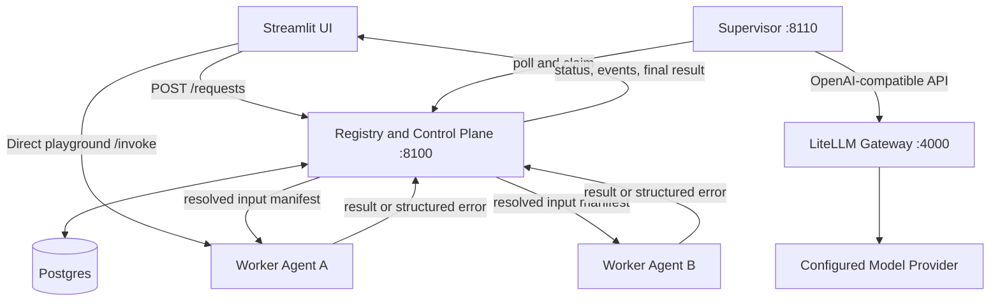
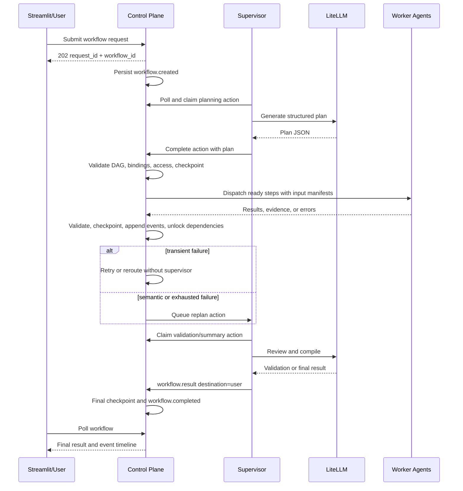

# Agent Runtime Control Plane and Supervisor Plan

Status: Design ready for approval and implementation

## 1. Purpose

This document is the implementation contract for the AgentMesh local agent runtime. It defines the independent Docker services, request and event conventions, workflow execution model, selective context routing, Postgres models and DDL, supervisor behavior, validation rules, implementation tasks, and test cases.

The central design rule is:

> Every durable request and workflow event passes through the control plane. The supervisor may inspect every output in its workflow, but each worker receives only the preplanned and access-checked input manifest for its step.

Implementation starts only after this document is reviewed and approved.

## 2. Goals and Boundaries

### Repository baseline and source-adoption policy

- `feature/Supervisor&RegistryPro` is the canonical implementation baseline.
- The Python package under `src/agentmesh/`, `pyproject.toml`, `deployment/`, and the
  current pytest suites remain the authoritative runtime, packaging, deployment,
  and test structure.
- `feature/LiteLLM` is a reference implementation only. It must not be merged,
  rebased, or treated as the parent of this branch because the branches have
  unrelated repository histories.
- Useful behavior from `feature/LiteLLM` is reimplemented behind current contracts
  and module boundaries. Files are not copied wholesale when a current equivalent
  already exists.
- The Go/Bazel platform, clients, packages, AgentFile runtime, runner, relay, and
  proto trees from `feature/LiteLLM` are outside this plan. Adding any of them
  requires a separate architecture decision and approval.
- Historical Markdown, generated sanity databases, logs, and captured outputs are
  not migration inputs. Tests regenerate evidence from the current implementation.
- Despite its branch name, `feature/LiteLLM` is not the source of the required
  supervisor LiteLLM Gateway. Gateway configuration is implemented from the
  approved contracts in this document and pinned independently.

The selective adoption matrix is:

| Reference practice | Decision in this repository |
|---|---|
| Dedicated registry and orchestrator Dockerfiles | Adopt the independent service boundary using current `src/agentmesh` packages |
| Compose health checks and dependency ordering | Adopt in `deployment/docker/compose.yml` |
| Environment-driven agent card, registration, heartbeat, and stale detection | Retain and extend the current runtime implementation |
| Legacy orchestrator `/invoke`, `tasks`, and `runs` interfaces | Preserve temporarily through adapters over the new control-plane model |
| SQLite registry fallback | Do not use as runtime authority; SQLite remains available for isolated tests only |
| Raw one-file schema initialization | Do not adopt; retain ordered, checksummed Postgres DDL migrations |
| Per-folder `requirements.txt` files | Do not adopt; retain pinned `pyproject.toml` dependency groups |
| Separate Streamlit image and telemetry configuration | Adopt the deployable boundary and disable usage telemetry |
| PowerShell sanity wrapper | Optional thin wrapper over the authoritative Python sanity runner |
| Generated SQLite catalogs, JSON reports, and logs | Regenerate during validation; do not port committed artifacts |

### Goals

- Run the registry/control plane and supervisor as independent Docker services.
- Make the control plane the durable queue, event store, workflow state authority, retry controller, and agent dispatcher.
- Make the supervisor responsible for planning, input selection, semantic validation, replanning, and final compilation.
- Support direct, sequential, multi-step, and parallel execution with explicit dependencies.
- Link upstream outputs to downstream inputs by stable step IDs and named bindings.
- Prevent workers from receiving unrelated or restricted context, including hidden QA tests.
- Persist resumable LangGraph checkpoints and link state-changing events to checkpoint IDs.
- Handle transient failures without waking the supervisor.
- Provide Streamlit playgrounds for agent contract tests, control-plane integration tests, and complete workflows.

### First-release boundaries

- Postgres is the source of truth; Redis and a separate message broker are not required.
- Workers retain synchronous `/invoke` endpoints; the control plane invokes them asynchronously from its dispatcher.
- The supervisor alone uses the LiteLLM Gateway in this release.
- Parallel joins use `all_required`; quorum and first-success joins are deferred.
- Local service-token authorization is included to enforce context isolation. Full production identity integration is deferred.
- Existing `tasks`, `runs`, and orchestrator `/invoke` behavior remains temporarily available as deprecated compatibility paths.

## 3. Runtime Topology



### Service ownership

| Service | Owns | Must not own |
|---|---|---|
| Control plane | Registration, requests, queue leases, DAG state, retries, dispatch, deterministic validation, events, checkpoints, authorization | LLM planning or semantic judgement |
| Supervisor | Plan generation, per-step context selection, quality review, hallucination checks, sibling reuse decisions, replanning, final summary | Direct worker invocation or in-memory workflow authority |
| LiteLLM Gateway | Supervisor model routing, provider credentials, provider fallback, normalized model API | Workflow retries or worker dispatch |
| Worker | Execute only the supplied task and input manifest, return structured output and evidence | Browse workflow events or access undeclared inputs |
| Streamlit | Submit requests, poll status, show progress, collect input and approvals | Execute or mutate workflow state directly |

## 4. Streamlit Playground Design

### 4.1 Agent Playground: Direct API Request

Purpose: unit and smoke testing of each registered agent contract.

```text
Streamlit -> Registry agent list -> Selected agent /invoke -> Streamlit
```

- Bypasses the control-plane execution queue.
- Does not perform workflow retries, checkpoints, or supervisor review.
- Displays request, response, status code, latency, and schema errors.
- A live-model agent must return a provider/configuration error when its model
  runtime is unavailable. It must never synthesize a successful fallback answer.

### 4.2 Agent Playground: Control Plane Request

Purpose: integration testing of registry lookup, queueing, agent selection, dispatch, retry, and events.

```text
Streamlit/HumanAgent -> Control Plane -> queue -> selected worker
                         selected worker -> Control Plane -> HumanAgent/result
```

- Uses `request_type=direct`.
- Does not involve the supervisor.
- Treats `HumanAgent` as the requesting supervisor actor for this single-agent
  integration path; it does not invoke the Docker supervisor service.
- Terminal failure is returned directly to the user.
- Returns immediately and renders the deterministic one-step control-plane dispatch
  as the proposed request, alongside live event flow, retries,
  validation, and terminal result in parallel. Streamlit polls a cursor-based public
  control-plane API and never reads Postgres directly.

### 4.3 Workflow Playground

The page has two independent tabs:

- `Orchestration` starts a new supervised workflow and retains that run's live state.
- `Open existing` accepts a workflow UUID and restores that run without replacing
  the orchestration tab's active workflow.

Rerun and checkpoint-recovery actions update only the workflow state owned by the
tab where the action was started.



The running workflow view uses a three-column operations layout: checkpoint and
recovery controls on the left, plan progress and user actions in the center, and a
newest-first linked event trail on the right. Each event shows its source and
destination beside the event name and exposes its complete output on demand.
Proposed, queued, running, validating, retrying, blocked, and completed step states
update without blocking approval or recovery controls. A unified interrupt panel
renders typed planning-input, plan approval, task approval, agent-output approval,
validation, and replan requests.

Checkpoint controls distinguish read-only inspection, diagnostic fork, full rerun,
same-workflow interrupt resume, and executable recovery. Executable recovery starts
a linked workflow from a selected checkpoint so immutable source history and prior
worker side effects are not overwritten.

When LangSmith tracing is enabled and a correlated trace has been ingested, the UI
shows an `Open LangSmith trace` link for the request/workflow ID. The control plane
resolves the authenticated trace URL through the LangSmith SDK; Streamlit never
receives the LangSmith API key and hides the link when tracing is disabled or no
trace is available.

All Streamlit data access uses public control-plane and registry HTTP APIs. The UI
must not import a Postgres driver, receive `DATABASE_URL`, or execute SQL.

## 5. Planning and Selective Context Routing

The supervisor defines the complete data-access plan before workers run. It may revise the plan later only by creating a new `plan_version`.

For every step, the supervisor must define:

- Stable `step_id` and display `position`.
- Agent role, exact agent, or capability selector.
- Dependency step IDs and `all_required` join behavior.
- Expected output schema and evidence requirements.
- Named input bindings from the root context or ancestor step outputs.
- Output visibility and classification.
- Explicit exclusions for hidden or irrelevant context.
- Checkpoint and semantic validation policy.

Position is never used as a data key. Data is linked by workflow ID, plan version, step ID, and named paths.

### Sequential example

```text
requirements -> architecture -> implementation -> QA execution
```

`implementation` receives selected fields from `requirements` and `architecture`, not their complete event histories.

### Parallel example

```text
                     +-> analysis-a --+
root -> preparation -+-> analysis-b --+-> synthesis
                     +-> analysis-c --+
```

```json
{
  "step_id": "synthesis",
  "depends_on": ["analysis-a", "analysis-b", "analysis-c"],
  "input_bindings": [
    {"alias": "a", "source_step_id": "analysis-a", "path": "$.result"},
    {"alias": "b", "source_step_id": "analysis-b", "path": "$.result"},
    {"alias": "c", "source_step_id": "analysis-c", "path": "$.result"}
  ]
}
```

Completion order cannot change input meaning because every branch is bound by alias and step ID.

### Hidden QA example

```text
Product output ---------+
Architecture output ----+-> SDE input manifest
Security output --------+
Hidden QA tests --------X-> SDE

SDE implementation -----+
Hidden QA tests ---------+-> QA execution manifest
```

The SDE receives no hidden test source, fixtures, assertions, or expected values. If QA fails, the supervisor creates sanitized feedback and decides which failure information the SDE may receive.

### Output classifications

| Classification | Allowed audience |
|---|---|
| `shared` | Supervisor and explicitly bound downstream roles |
| `supervisor_only` | Supervisor and control plane |
| `role:<name>` | Supervisor and that agent role |
| `user_only` | User-facing result delivery |
| `hidden_validation` | Supervisor and validator/QA roles only |

The control plane enforces visibility when resolving an input manifest. Prompt instructions alone are not an access-control boundary.

## 6. Long-task Planning Input Gate

For long, ambiguous, or high-risk requests, the supervisor may pause planning and issue a predefined `planning.input_requested` event.

```text
planning -> missing required information -> awaiting_input
awaiting_input -> planning.input_provided -> checkpoint -> planning resumes
```

The event contains a JSON-schema-like list of required fields so Streamlit can render an input form. The response must reference the original event through `reply_to_event_id`. The control plane resumes planning only when every required field is present and valid.

Typical requested input includes acceptance criteria, authoritative sources, constraints, deliverable format, repository or artifact references, risk approval, and unresolved choices.

## 7. Workflow State Machines

### Execution request

```text
queued -> ready -> claimed -> running -> completed
                              |
                              +-> waiting_retry -> ready
                              +-> awaiting_input -> ready
                              +-> failed -> dead_letter
                              +-> cancelled
```

### Workflow

```text
submitted -> planning -> awaiting_input -> planning
planning -> executing -> awaiting_checkpoint -> executing
executing -> awaiting_supervisor -> executing
awaiting_supervisor -> awaiting_approval -> executing
awaiting_supervisor -> completed
any non-terminal state -> failed | rejected | cancelled
```

### Step

```text
pending -> blocked -> ready -> dispatched -> running
running -> completed_unvalidated -> validated
running -> waiting_retry -> ready
running -> terminal_failed
validated -> reused in a later plan version
```

After every state transition, the control plane updates current state and appends an immutable event in one database transaction.

## 8. Event Model and Catalog

Every event contains:

```json
{
  "event_id": "evt_...",
  "event_type": "task.completed",
  "request_id": "req_...",
  "workflow_id": "wf_...",
  "plan_version": 1,
  "step_id": "implementation",
  "checkpoint_id": "cp_...",
  "source": {"type": "agent", "id": "sde-agent"},
  "destination": {"type": "control_plane", "id": "registry"},
  "classification": "shared",
  "status": "completed",
  "payload": {},
  "created_at": "2026-09-01T00:00:00Z"
}
```

`checkpoint_id` is required for every durable request from its initial accepted
event onward. Direct HumanAgent requests use control-plane event-cursor checkpoints;
supervised workflows additionally use native LangGraph state checkpoints. Transport-only
or diagnostic events may omit a LangGraph checkpoint but retain their event checkpoint.

| Event type | Source -> destination | Meaning |
|---|---|---|
| `request.accepted` | User -> control plane | Durable request created |
| `workflow.created` | Control plane -> supervisor | Workflow requires planning |
| `planning.input_requested` | Supervisor -> user/agent | Blocking structured input request |
| `planning.input_provided` | User/agent -> supervisor | Requested information supplied |
| `plan.proposed` | Supervisor -> control plane | New structured plan version |
| `plan.accepted` | Control plane -> supervisor | DAG, bindings, and access rules are valid |
| `plan.rejected` | Control plane -> supervisor | Plan requires correction |
| `step.input_manifest_created` | Control plane -> target agent | Inputs resolved and frozen |
| `step.input_access_denied` | Control plane -> supervisor | Binding violates visibility rules |
| `step.dispatched` | Control plane -> worker | Worker invocation started |
| `task.completed` | Worker -> control plane | Structured result received |
| `task.failed` | Worker/control plane -> control plane | Attempt failed |
| `task.retry_scheduled` | Control plane -> control plane | Mechanical retry scheduled |
| `task.evidence_requested` | Supervisor -> worker/verifier | More support is required |
| `task.evidence_provided` | Worker/verifier -> supervisor | Evidence returned |
| `checkpoint.validation_requested` | Control plane -> supervisor | Semantic checkpoint review required |
| `checkpoint.validation_completed` | Supervisor -> control plane | Checkpoint accepted or rejected |
| `validation.feedback_prepared` | Supervisor -> worker | Sanitized feedback for corrective work |
| `workflow.replan_requested` | Control plane -> supervisor | Terminal or semantic failure requires a new plan |
| `workflow.summary_requested` | Control plane -> supervisor | All mandatory work is valid |
| `workflow.result` | Supervisor -> user | Compiled final response |
| `workflow.completed` | Control plane -> user | Final result persisted and workflow closed |
| `workflow.awaiting_approval` | Control plane -> user | Risk or retry budget requires a decision |
| `decision.recorded` | User -> control plane | Approve, reject, or cancel decision persisted |
| `agent.performance_recorded` | Control plane -> supervisor | Objective attempt metrics captured |

## 9. Checkpoints and Resumption

Postgres workflow tables are authoritative. LangGraph checkpoints are resumable execution snapshots, not the only workflow record.

A checkpoint is created after:

- Plan acceptance or replan acceptance.
- Blocking input receipt.
- Step completion or terminal failure.
- Parallel barrier completion.
- Checkpoint validation.
- Approval or rejection.
- Final workflow completion.

Checkpoint metadata contains the workflow ID, plan version, active/blocked/completed steps, resolved input-manifest references, output/artifact references, retry counters, pending supervisor action, and parent checkpoint ID. The triggering event stores the resulting `checkpoint_id`.

On restart, the reconciler loads current database state, verifies the latest checkpoint mapping, expires stale leases, and resumes ready work without replaying completed side effects.

## 10. Supervisor and LiteLLM

- LiteLLM runs as a required Compose service using a pinned stable image.
- The supervisor calls its OpenAI-compatible API with a gateway key and base URL.
- Provider credentials exist only in the LiteLLM container.
- Logical aliases are `supervisor-planner`, `supervisor-validator`, and `supervisor-summarizer`; they may initially map to the same upstream model.
- LiteLLM performs at most one provider-level retry or fallback. The control plane owns durable supervisor-action retry budgets.
- The supervisor validates every model result through Pydantic. One schema-repair call is permitted before the action is reported as retryable or failed.
- Planning, validation, replanning, and summary prompts are versioned and recorded with model name, latency, token usage, and outcome. Hidden reasoning is not persisted.
- Docker health checks use LiteLLM's liveness endpoint. The general model-health response is not exposed publicly.

### LangSmith observability and evaluation fix

- LangSmith tracing is disabled by default and enabled only when both the feature
  flag and credentials are present. Local execution and deterministic CI never
  require hosted tracing.
- One root trace represents one direct request or workflow execution. Child runs
  represent supervisor actions, worker attempts, validation decisions, checkpoint
  persistence, and final compilation. Separate processes propagate an explicit,
  optional trace context through the control plane instead of creating unrelated
  root traces.
- Every traceable operation uses stable metadata: `request_id`, `workflow_id`,
  `plan_version`, `step_id`, `attempt_id`, `agent_id`, `runtime_instance_id`,
  `checkpoint_id`, event ID, execution mode, author, source, and destination.
- PostgreSQL stores nullable LangSmith trace/run references for correlation. These
  references are diagnostic only and are never required to project workflow state.
- Routine registry heartbeats, lease-renew polling, and empty queue polls do not
  create spans. State changes, degraded/recovered transitions, retries, and terminal
  failures remain traceable.
- Trace inputs and outputs are allowlisted and redacted. Provider keys, service
  tokens, claim tokens, hidden QA content, complete input manifests, and restricted
  artifacts are never exported. Presence booleans, hashes, sizes, and approved
  summaries are used instead.
- LangSmith authentication, quota, timeout, SDK, or export failures increment a
  local metric and structured log but do not change a request, step, checkpoint, or
  workflow status. Export uses bounded timeouts and never participates in a database
  transaction.
- Runtime validation is performed by the control plane and supervisor contracts.
  LangSmith evaluators are regression and release gates only; they cannot approve,
  reject, retry, or replan a live workflow.
- Hosted evaluation is required only in an explicit secret-enabled CI mode. Missing
  credentials skip hosted checks locally, while configured evaluation jobs fail on
  authentication errors, missing traces, metadata/redaction violations, or scores
  below approved thresholds.

References: [LiteLLM documentation](https://docs.litellm.ai/) and [LiteLLM release notes](https://github.com/BerriAI/litellm-docs/blob/main/release_notes/index.md).

## 11. Validation and Hallucination Controls

### Control-plane validation

- Request and event schema validation.
- DAG acyclicity and valid step references.
- Every input source is the root or an ancestor dependency.
- Every required binding path exists in a validated output.
- Destination role is allowed by the source visibility policy.
- Required steps and parallel branches are complete before a barrier opens.
- Worker output matches the declared schema.
- Required artifacts exist and checksums match.
- Lease, attempt, and idempotency invariants hold.

### Supervisor validation

- Output satisfies the task objective and acceptance criteria.
- Factual claims have evidence or authoritative source references where required.
- Agent outputs do not contradict one another without an explicit resolution.
- Assumptions and uncertainty are disclosed.
- QA or verifier evidence supports completion.
- Failed work can be repaired, rerouted, reused, or requires human approval.

### Validation state and consistency fix

- A worker response first enters `completed_unvalidated`; it cannot directly mark a
  step or workflow complete.
- Deterministic validation runs before semantic validation and checks the immutable
  output hash, schema, required paths, evidence shape, artifact checksums, access
  classification, attempt ownership, and idempotency key.
- Every validation decision is append-only and records `validation_id`, action ID,
  output hash, policy/prompt version, validator identity, findings, evidence
  references, decision, and timestamp. `workflow_steps.validation_status` is only a
  current-state projection.
- A semantic validator must return a structured decision of `passed`, `failed`, or
  `needs_evidence`. Free-form text cannot advance the state machine.
- Validation completion is idempotent by supervisor action ID and validation ID.
  Duplicate decisions return the original result; a decision for an older output
  hash or plan version is rejected as stale.
- A failed schema or contract check returns corrective work to the responsible
  worker when retryable. Unsupported claims, contradictions, or objective mismatch
  request evidence, rework, or replan according to policy; they are not disguised as
  transport retries.
- A step becomes `validated` only in the same database transaction that stores the
  validation record, appends the validation event, updates the current projection,
  and preallocates the checkpoint ID. The checkpointer writes that ID idempotently
  after commit; reconciliation completes the mapping if checkpoint persistence fails.
- Parallel barriers count only `validated` required predecessors. A completed but
  unvalidated, stale, failed, or superseded output cannot unlock downstream work.
- Summary work is queued exactly once only when every mandatory step in the active
  plan version is validated or has a recorded human waiver. The supervisor cannot
  waive its own validation failure.
- Human waiver requires a scoped authorization decision, reason, affected output
  hash, and audit event. Hidden QA details remain restricted in waiver and rework
  messages.
- Validation budgets are risk based and bounded. Exhaustion moves the workflow to
  approval or terminal failure; it never creates an infinite replan loop.

### Objective performance metrics

The control plane records latency, attempts, retries, timeouts, schema failures, validation failures, output size, agent selection, and final status. The supervisor may use these metrics when selecting an agent during replan. Self-reported confidence is evidence, not an objective performance metric.

### Worker result contract for checked tasks

```json
{
  "status": "completed",
  "result": {},
  "claims": [
    {
      "claim": "A verifiable statement",
      "evidence_refs": ["artifact:test-results"],
      "confidence": 0.9
    }
  ],
  "artifacts": [],
  "assumptions": [],
  "limitations": []
}
```

## 12. Error and Retry Policy

| Failure | Control-plane action | Supervisor action |
|---|---|---|
| HTTP 429 | Honor `Retry-After`, back off with jitter, retry or reroute capability target | None until exhausted |
| Timeout/connection reset | Retry with the same immutable input manifest | None until exhausted |
| Agent busy/stale | Wait or select another compatible agent | None |
| HTTP 502/503/504 | Retry; use circuit breaker for repeatedly failing agent | None until exhausted |
| HTTP 500 | Retry once, then classify as terminal if repeated | Replan after terminal failure |
| HTTP 400/422 | Do not retry unchanged input | Correct plan or input |
| HTTP 401/403 | Stop; configuration or approval required | Human/configuration action |
| Output schema failure | Do not mark step complete | Ask for correction or replan |
| Semantic/checkpoint failure | Preserve attempt and evidence | Reuse, invalidate, or replan |
| Access-policy violation | Never dispatch | Correct plan bindings |
| Unknown side-effect result | Retry only with target idempotency support | Otherwise require approval |

Defaults: four total mechanical attempts, exponential backoff with full jitter, `Retry-After` support, low-risk three replans, medium-risk one replan, and approval before high-risk execution or every high-risk replan.

## 13. Public and Internal APIs

### Public/UI APIs

| Method | Endpoint | Purpose |
|---|---|---|
| `POST` | `/requests` | Submit direct or workflow request; return `202` |
| `GET` | `/requests/{request_id}` | Direct request state and result |
| `GET` | `/workflows/{workflow_id}` | Workflow graph, progress, validation, and result |
| `GET` | `/workflows/{workflow_id}/events` | Authorized event timeline |
| `POST` | `/workflows/{workflow_id}/inputs/{event_id}` | Answer a blocking input request |
| `POST` | `/workflows/{workflow_id}/decisions` | Approve, reject, or cancel |
| `GET` | `/workflows/{workflow_id}/activity` | Cursor-based workflow, step, interrupt, event, and result projection |
| `GET` | `/workflows/{workflow_id}/trace-link` | Resolve a safe LangSmith trace URL when tracing is enabled |
| `POST` | `/workflows/{workflow_id}/recover` | Start linked executable recovery from a selected or latest resumable checkpoint |
| `GET` | `/registry/resources` | Read resource inventory without UI database access |
| `GET` | `/registry/audit-events` | Read resource audit events without UI database access |

### Supervisor queue APIs

| Method | Endpoint | Purpose |
|---|---|---|
| `POST` | `/queue/claim` | Atomically claim one matching supervisor action |
| `POST` | `/queue/{request_id}/renew` | Renew the lease during a long model call |
| `POST` | `/queue/{request_id}/complete` | Return plan, validation, replan, or summary result |
| `POST` | `/queue/{request_id}/fail` | Return a structured retryable or terminal error |

### Existing agent APIs

- `POST /agents/register`
- `POST /agents/{agent_id}/heartbeat`
- `GET /agents`
- `GET /agents/search`
- Worker `GET /health`, `GET /agent-card`, and `POST /invoke`

### Async submission response

```json
{
  "request_id": "req_123",
  "workflow_id": "wf_123",
  "status": "queued",
  "status_url": "/workflows/wf_123",
  "submitted_at": "2026-09-01T00:00:00Z"
}
```

## 14. Application Models

### RequestEnvelope

| Field | Type | Rule |
|---|---|---|
| `request_type` | `direct | workflow | workflow_step | supervisor_action` | Required |
| `message_type` | String enum | Defines action/event intent |
| `source` | `{type, id}` | Derived or verified by control plane |
| `destination` | `{type, id?, capability?}` | ID or capability required |
| `message` | String | Required for user and worker tasks |
| `context` | Object | Root context or internal action payload |
| `risk_level` | `low | medium | high` | Defaults to low |
| `policy` | Object | Retry, reroute, approval, and timeout policy |
| `idempotency_key` | String | Required for public submission |
| `parent_request_id` | String/null | Internal lineage |
| `correlation_id` | String | Root request/workflow correlation |
| `trace_context` | Object/null | Trusted internal propagation only; ignored from untrusted public input |

### PlanDefinition

| Field | Type | Rule |
|---|---|---|
| `workflow_id` | String | Required |
| `plan_version` | Integer | Monotonically increasing |
| `goal` | String | User objective |
| `acceptance_criteria` | Array | Required before execution |
| `steps` | Array of `PlanStep` | At least one |
| `risk_level` | Enum | May raise but not lower user-selected risk without reason |
| `summary_policy` | Object | Final output requirements |

### PlanStep

| Field | Type | Rule |
|---|---|---|
| `step_id` | String | Unique within plan version |
| `position` | Integer | Display-only ordering |
| `title` and `instructions` | String | Required |
| `agent_role` | String | Required |
| `target_agent_id` or `target_capability` | String/null | One selector required |
| `depends_on` | String array | Ancestors only |
| `required` | Boolean | Defaults true |
| `input_bindings` | Array of `InputBinding` | Explicit data lineage |
| `excluded_step_ids` | String array | Explicit context firewall |
| `output_schema` | JSON Schema object | Required |
| `output_visibility` | String array | Defaults supervisor-only |
| `classification` | Enum | Access policy |
| `checkpoint_policy` | Object | Deterministic and semantic checks |

### InputBinding

| Field | Type | Rule |
|---|---|---|
| `alias` | String | Unique in destination manifest |
| `source_type` | `root | step | artifact` | Required |
| `source_step_id` | String/null | Required for step source |
| `source_plan_version` | Integer/null | Required when reusing older output |
| `path` | JSONPath-like string | Restricted, validated selector |
| `required` | Boolean | Missing required binding blocks dispatch |
| `transform` | `none | summarize | redact` | Supervisor-declared transformation |

### WorkerInvokeRequest

Contains `request_id`, `workflow_id`, `plan_version`, `step_id`, `position`, `attempt_id`, `manifest_id`, `idempotency_key`, instructions, resolved inputs, expected output schema, evidence policy, deadline, and an optional sanitized internal `trace_context`.

### StructuredError

Contains `code`, `category`, `message`, `retryable`, `retry_after_seconds`, `details`, and `unknown_side_effect`.

### ValidationDecision

Contains `validation_id`, `supervisor_action_id`, `workflow_id`, `plan_version`,
`step_id`, `output_hash`, `validation_type`, `decision`, `validator_id`,
`policy_version`, optional `prompt_version`, structured findings, evidence references,
and sanitized corrective feedback. The control plane rejects unknown fields and
verifies all identifiers and the output hash before applying the decision.

## 15. Planned Postgres DDL

The implementation will add `db/postgress/ddls/002_control_plane_workflows.sql` with the following schema. SQLAlchemy models must mirror it, and SQLite tests must preserve equivalent constraints where supported.

```sql
CREATE TABLE IF NOT EXISTS execution_requests (
    request_id VARCHAR(64) PRIMARY KEY,
    idempotency_key VARCHAR(128) NOT NULL,
    request_type VARCHAR(32) NOT NULL,
    message_type VARCHAR(64) NOT NULL,
    source_type VARCHAR(32) NOT NULL,
    source_id VARCHAR(128) NOT NULL,
    destination_type VARCHAR(32) NOT NULL,
    destination_id VARCHAR(128),
    destination_capability VARCHAR(128),
    parent_request_id VARCHAR(64) REFERENCES execution_requests(request_id),
    correlation_id VARCHAR(64) NOT NULL,
    trace_context JSONB NOT NULL DEFAULT '{}'::jsonb,
    workflow_id VARCHAR(64),
    payload JSONB NOT NULL DEFAULT '{}'::jsonb,
    policy JSONB NOT NULL DEFAULT '{}'::jsonb,
    priority SMALLINT NOT NULL DEFAULT 0,
    status VARCHAR(32) NOT NULL DEFAULT 'queued',
    available_at TIMESTAMPTZ NOT NULL,
    lease_owner VARCHAR(128),
    lease_token VARCHAR(128),
    lease_expires_at TIMESTAMPTZ,
    attempt_count INTEGER NOT NULL DEFAULT 0,
    max_attempts INTEGER NOT NULL DEFAULT 4,
    response JSONB,
    error JSONB,
    created_at TIMESTAMPTZ NOT NULL,
    updated_at TIMESTAMPTZ NOT NULL,
    completed_at TIMESTAMPTZ,
    CONSTRAINT ck_execution_requests_type CHECK (
        request_type IN ('direct', 'workflow', 'workflow_step', 'supervisor_action')
    ),
    CONSTRAINT ck_execution_requests_status CHECK (
        status IN ('queued', 'ready', 'claimed', 'running', 'waiting_retry',
                   'awaiting_input', 'completed', 'failed', 'dead_letter', 'cancelled')
    ),
    CONSTRAINT ck_execution_requests_destination CHECK (
        destination_id IS NOT NULL OR destination_capability IS NOT NULL
    ),
    CONSTRAINT uq_execution_requests_idempotency
        UNIQUE (source_type, source_id, idempotency_key)
);

CREATE TABLE IF NOT EXISTS workflows (
    workflow_id VARCHAR(64) PRIMARY KEY,
    root_request_id VARCHAR(64) NOT NULL UNIQUE
        REFERENCES execution_requests(request_id) ON DELETE CASCADE,
    supervisor_agent_id VARCHAR(128) NOT NULL,
    status VARCHAR(32) NOT NULL DEFAULT 'submitted',
    risk_level VARCHAR(16) NOT NULL DEFAULT 'low',
    active_plan_version INTEGER NOT NULL DEFAULT 0,
    replan_count INTEGER NOT NULL DEFAULT 0,
    final_result JSONB,
    error JSONB,
    langsmith_trace_id VARCHAR(64),
    created_at TIMESTAMPTZ NOT NULL,
    updated_at TIMESTAMPTZ NOT NULL,
    completed_at TIMESTAMPTZ,
    CONSTRAINT ck_workflows_status CHECK (
        status IN ('submitted', 'planning', 'awaiting_input', 'executing',
                   'awaiting_checkpoint', 'awaiting_supervisor', 'awaiting_approval',
                   'completed', 'failed', 'rejected', 'cancelled')
    ),
    CONSTRAINT ck_workflows_risk CHECK (risk_level IN ('low', 'medium', 'high'))
);

CREATE TABLE IF NOT EXISTS workflow_plans (
    workflow_id VARCHAR(64) NOT NULL REFERENCES workflows(workflow_id) ON DELETE CASCADE,
    plan_version INTEGER NOT NULL,
    status VARCHAR(24) NOT NULL DEFAULT 'proposed',
    goal TEXT NOT NULL,
    acceptance_criteria JSONB NOT NULL DEFAULT '[]'::jsonb,
    plan_payload JSONB NOT NULL,
    created_by VARCHAR(128) NOT NULL,
    created_at TIMESTAMPTZ NOT NULL,
    accepted_at TIMESTAMPTZ,
    PRIMARY KEY (workflow_id, plan_version),
    CONSTRAINT ck_workflow_plans_status CHECK (
        status IN ('proposed', 'accepted', 'rejected', 'superseded')
    )
);

CREATE TABLE IF NOT EXISTS workflow_steps (
    workflow_id VARCHAR(64) NOT NULL,
    plan_version INTEGER NOT NULL,
    step_id VARCHAR(128) NOT NULL,
    position INTEGER NOT NULL,
    title VARCHAR(256) NOT NULL,
    instructions TEXT NOT NULL,
    agent_role VARCHAR(128) NOT NULL,
    target_agent_id VARCHAR(128),
    target_capability VARCHAR(128),
    required BOOLEAN NOT NULL DEFAULT TRUE,
    status VARCHAR(32) NOT NULL DEFAULT 'pending',
    input_bindings JSONB NOT NULL DEFAULT '[]'::jsonb,
    excluded_step_ids JSONB NOT NULL DEFAULT '[]'::jsonb,
    output_schema JSONB NOT NULL DEFAULT '{}'::jsonb,
    output_visibility JSONB NOT NULL DEFAULT '["supervisor_only"]'::jsonb,
    classification VARCHAR(32) NOT NULL DEFAULT 'supervisor_only',
    checkpoint_policy JSONB NOT NULL DEFAULT '{}'::jsonb,
    output JSONB,
    artifact_refs JSONB NOT NULL DEFAULT '[]'::jsonb,
    validation_status VARCHAR(24) NOT NULL DEFAULT 'pending',
    validation_result JSONB,
    reused_from_plan_version INTEGER,
    reused_from_step_id VARCHAR(128),
    created_at TIMESTAMPTZ NOT NULL,
    started_at TIMESTAMPTZ,
    completed_at TIMESTAMPTZ,
    PRIMARY KEY (workflow_id, plan_version, step_id),
    FOREIGN KEY (workflow_id, plan_version)
        REFERENCES workflow_plans(workflow_id, plan_version) ON DELETE CASCADE,
    CONSTRAINT ck_workflow_steps_target CHECK (
        target_agent_id IS NOT NULL OR target_capability IS NOT NULL
    ),
    CONSTRAINT ck_workflow_steps_status CHECK (
        status IN ('pending', 'blocked', 'ready', 'dispatched', 'running',
                   'waiting_retry', 'completed_unvalidated', 'validated',
                   'terminal_failed', 'cancelled')
    ),
    CONSTRAINT ck_workflow_steps_validation CHECK (
        validation_status IN ('pending', 'rules_passed', 'awaiting_supervisor',
                              'passed', 'failed', 'waived')
    )
);

CREATE TABLE IF NOT EXISTS workflow_step_dependencies (
    workflow_id VARCHAR(64) NOT NULL,
    plan_version INTEGER NOT NULL,
    step_id VARCHAR(128) NOT NULL,
    depends_on_step_id VARCHAR(128) NOT NULL,
    required BOOLEAN NOT NULL DEFAULT TRUE,
    created_at TIMESTAMPTZ NOT NULL,
    PRIMARY KEY (workflow_id, plan_version, step_id, depends_on_step_id),
    FOREIGN KEY (workflow_id, plan_version, step_id)
        REFERENCES workflow_steps(workflow_id, plan_version, step_id) ON DELETE CASCADE,
    FOREIGN KEY (workflow_id, plan_version, depends_on_step_id)
        REFERENCES workflow_steps(workflow_id, plan_version, step_id) ON DELETE CASCADE,
    CONSTRAINT ck_workflow_dependency_not_self CHECK (step_id <> depends_on_step_id)
);

CREATE TABLE IF NOT EXISTS step_input_manifests (
    manifest_id VARCHAR(64) PRIMARY KEY,
    workflow_id VARCHAR(64) NOT NULL,
    plan_version INTEGER NOT NULL,
    step_id VARCHAR(128) NOT NULL,
    manifest_version INTEGER NOT NULL,
    created_by VARCHAR(128) NOT NULL,
    bindings JSONB NOT NULL,
    resolved_inputs JSONB NOT NULL,
    excluded_sources JSONB NOT NULL DEFAULT '[]'::jsonb,
    content_hash VARCHAR(128) NOT NULL,
    created_at TIMESTAMPTZ NOT NULL,
    FOREIGN KEY (workflow_id, plan_version, step_id)
        REFERENCES workflow_steps(workflow_id, plan_version, step_id) ON DELETE CASCADE,
    UNIQUE (workflow_id, plan_version, step_id, manifest_version)
);

CREATE TABLE IF NOT EXISTS execution_attempts (
    attempt_id VARCHAR(64) PRIMARY KEY,
    request_id VARCHAR(64) NOT NULL
        REFERENCES execution_requests(request_id) ON DELETE CASCADE,
    workflow_id VARCHAR(64),
    plan_version INTEGER,
    step_id VARCHAR(128),
    manifest_id VARCHAR(64) REFERENCES step_input_manifests(manifest_id),
    attempt_number INTEGER NOT NULL,
    agent_id VARCHAR(128) NOT NULL,
    idempotency_key VARCHAR(128) NOT NULL,
    status VARCHAR(24) NOT NULL,
    request_payload JSONB NOT NULL,
    response JSONB,
    error JSONB,
    http_status INTEGER,
    retryable BOOLEAN NOT NULL DEFAULT FALSE,
    retry_after_seconds INTEGER,
    langsmith_run_id VARCHAR(64),
    started_at TIMESTAMPTZ NOT NULL,
    completed_at TIMESTAMPTZ,
    FOREIGN KEY (workflow_id, plan_version, step_id)
        REFERENCES workflow_steps(workflow_id, plan_version, step_id),
    UNIQUE (request_id, attempt_number),
    CONSTRAINT ck_execution_attempts_status CHECK (
        status IN ('running', 'completed', 'failed', 'timed_out', 'cancelled')
    )
);

CREATE TABLE IF NOT EXISTS workflow_events (
    event_sequence BIGSERIAL PRIMARY KEY,
    event_id VARCHAR(64) NOT NULL UNIQUE,
    event_type VARCHAR(64) NOT NULL,
    request_id VARCHAR(64) REFERENCES execution_requests(request_id),
    workflow_id VARCHAR(64) REFERENCES workflows(workflow_id) ON DELETE CASCADE,
    plan_version INTEGER,
    step_id VARCHAR(128),
    checkpoint_id VARCHAR(128),
    source_type VARCHAR(32) NOT NULL,
    source_id VARCHAR(128) NOT NULL,
    destination_type VARCHAR(32) NOT NULL,
    destination_id VARCHAR(128),
    classification VARCHAR(32) NOT NULL DEFAULT 'supervisor_only',
    status VARCHAR(32) NOT NULL,
    payload JSONB NOT NULL DEFAULT '{}'::jsonb,
    langsmith_run_id VARCHAR(64),
    created_at TIMESTAMPTZ NOT NULL
);

CREATE TABLE IF NOT EXISTS workflow_checkpoints (
    checkpoint_id VARCHAR(128) PRIMARY KEY,
    workflow_id VARCHAR(64) NOT NULL REFERENCES workflows(workflow_id) ON DELETE CASCADE,
    plan_version INTEGER NOT NULL,
    parent_checkpoint_id VARCHAR(128) REFERENCES workflow_checkpoints(checkpoint_id),
    trigger_event_id VARCHAR(64) REFERENCES workflow_events(event_id),
    checkpoint_namespace VARCHAR(128) NOT NULL,
    state_digest VARCHAR(128) NOT NULL,
    metadata JSONB NOT NULL DEFAULT '{}'::jsonb,
    created_at TIMESTAMPTZ NOT NULL
);

CREATE TABLE IF NOT EXISTS workflow_artifacts (
    artifact_id VARCHAR(64) PRIMARY KEY,
    workflow_id VARCHAR(64) NOT NULL REFERENCES workflows(workflow_id) ON DELETE CASCADE,
    plan_version INTEGER NOT NULL,
    step_id VARCHAR(128) NOT NULL,
    uri TEXT NOT NULL,
    media_type VARCHAR(128),
    checksum VARCHAR(128),
    classification VARCHAR(32) NOT NULL DEFAULT 'supervisor_only',
    allowed_roles JSONB NOT NULL DEFAULT '[]'::jsonb,
    metadata JSONB NOT NULL DEFAULT '{}'::jsonb,
    created_at TIMESTAMPTZ NOT NULL,
    FOREIGN KEY (workflow_id, plan_version, step_id)
        REFERENCES workflow_steps(workflow_id, plan_version, step_id) ON DELETE CASCADE
);

CREATE TABLE IF NOT EXISTS step_validations (
    validation_id VARCHAR(64) PRIMARY KEY,
    supervisor_action_id VARCHAR(64) REFERENCES execution_requests(request_id),
    workflow_id VARCHAR(64) NOT NULL,
    plan_version INTEGER NOT NULL,
    step_id VARCHAR(128) NOT NULL,
    output_hash VARCHAR(128) NOT NULL,
    validation_type VARCHAR(24) NOT NULL,
    decision VARCHAR(24) NOT NULL,
    validator_type VARCHAR(24) NOT NULL,
    validator_id VARCHAR(128) NOT NULL,
    policy_version VARCHAR(64) NOT NULL,
    prompt_version VARCHAR(64),
    findings JSONB NOT NULL DEFAULT '[]'::jsonb,
    evidence_refs JSONB NOT NULL DEFAULT '[]'::jsonb,
    supersedes_validation_id VARCHAR(64) REFERENCES step_validations(validation_id),
    langsmith_run_id VARCHAR(64),
    created_at TIMESTAMPTZ NOT NULL,
    FOREIGN KEY (workflow_id, plan_version, step_id)
        REFERENCES workflow_steps(workflow_id, plan_version, step_id) ON DELETE CASCADE,
    CONSTRAINT ck_step_validations_type CHECK (
        validation_type IN ('deterministic', 'semantic', 'qa', 'human_waiver')
    ),
    CONSTRAINT ck_step_validations_decision CHECK (
        decision IN ('passed', 'failed', 'needs_evidence', 'waived', 'stale')
    ),
    CONSTRAINT uq_step_validations_action UNIQUE (supervisor_action_id),
    CONSTRAINT uq_step_validations_decision UNIQUE (
        workflow_id, plan_version, step_id, output_hash, validation_type,
        validator_id, policy_version
    )
);

CREATE TABLE IF NOT EXISTS agent_evaluations (
    evaluation_id VARCHAR(64) PRIMARY KEY,
    workflow_id VARCHAR(64) NOT NULL REFERENCES workflows(workflow_id) ON DELETE CASCADE,
    plan_version INTEGER NOT NULL,
    step_id VARCHAR(128) NOT NULL,
    agent_id VARCHAR(128) NOT NULL,
    evaluation_type VARCHAR(32) NOT NULL,
    passed BOOLEAN NOT NULL,
    score NUMERIC(5,4),
    metrics JSONB NOT NULL DEFAULT '{}'::jsonb,
    findings JSONB NOT NULL DEFAULT '[]'::jsonb,
    evidence_refs JSONB NOT NULL DEFAULT '[]'::jsonb,
    created_by VARCHAR(128) NOT NULL,
    langsmith_run_id VARCHAR(64),
    created_at TIMESTAMPTZ NOT NULL,
    CONSTRAINT ck_agent_evaluations_type CHECK (
        evaluation_type IN ('performance', 'quality', 'hallucination', 'checkpoint')
    )
);

CREATE TABLE IF NOT EXISTS workflow_decisions (
    decision_id VARCHAR(64) PRIMARY KEY,
    workflow_id VARCHAR(64) NOT NULL REFERENCES workflows(workflow_id) ON DELETE CASCADE,
    plan_version INTEGER NOT NULL,
    decision VARCHAR(24) NOT NULL,
    actor_type VARCHAR(32) NOT NULL,
    actor_id VARCHAR(128) NOT NULL,
    payload JSONB NOT NULL DEFAULT '{}'::jsonb,
    created_at TIMESTAMPTZ NOT NULL,
    CONSTRAINT ck_workflow_decisions_decision CHECK (
        decision IN ('approve', 'reject', 'cancel', 'provide_input')
    )
);

CREATE INDEX IF NOT EXISTS idx_execution_requests_dispatch
    ON execution_requests(status, available_at, priority DESC);
CREATE INDEX IF NOT EXISTS idx_execution_requests_destination
    ON execution_requests(destination_type, destination_id, status);
CREATE INDEX IF NOT EXISTS idx_execution_requests_workflow
    ON execution_requests(workflow_id, created_at);
CREATE INDEX IF NOT EXISTS idx_workflows_status
    ON workflows(status, updated_at);
CREATE INDEX IF NOT EXISTS idx_workflow_steps_ready
    ON workflow_steps(workflow_id, plan_version, status, position);
CREATE INDEX IF NOT EXISTS idx_execution_attempts_step
    ON execution_attempts(workflow_id, plan_version, step_id, attempt_number);
CREATE INDEX IF NOT EXISTS idx_workflow_events_timeline
    ON workflow_events(workflow_id, event_sequence);
CREATE INDEX IF NOT EXISTS idx_workflow_events_destination
    ON workflow_events(destination_type, destination_id, event_sequence);
CREATE INDEX IF NOT EXISTS idx_workflow_checkpoints_latest
    ON workflow_checkpoints(workflow_id, created_at DESC);
CREATE INDEX IF NOT EXISTS idx_agent_evaluations_agent
    ON agent_evaluations(agent_id, created_at DESC);
CREATE INDEX IF NOT EXISTS idx_step_validations_output
    ON step_validations(workflow_id, plan_version, step_id, output_hash, created_at DESC);
CREATE INDEX IF NOT EXISTS idx_execution_attempts_langsmith
    ON execution_attempts(langsmith_run_id)
    WHERE langsmith_run_id IS NOT NULL;
```

## 16. Authorization Model

The local first release uses scoped service tokens supplied through environment variables.

| Principal | Required scopes |
|---|---|
| Streamlit/user | Submit requests, read its requests/workflows, answer input, approve/reject/cancel |
| Supervisor | Claim supervisor actions, read all events and outputs for assigned workflows, return plans and decisions |
| Worker | No workflow-event listing; only receives inbound `/invoke` requests and may register/heartbeat |
| Control plane dispatcher | Invoke registered workers and write attempts/events |

Event and artifact query responses must enforce classification and workflow ownership. The control plane never includes hidden or excluded data in a worker request, logs, or error response.

## 17. Implementation Tasks

### Phase 0: Repository alignment and selective adoption

| ID | Task | Dependencies | Acceptance |
|---|---|---|---|
| R1 | Record `feature/Supervisor&RegistryPro` as the canonical baseline and prohibit unrelated-history merges in contributor guidance | None | Implementation PRs target the current Python tree and do not remove or import unrelated platform trees |
| R2 | Map legacy LiteLLM runtime endpoints, environment names, and response shapes to current services | R1 | Compatibility matrix covers `/invoke`, `tasks`, `runs`, registration, search, health, and heartbeat |
| R3 | Define registry, control-plane, supervisor, worker, UI, and LiteLLM image boundaries using current import paths | R1 | Every image has one role, health contract, dependency group, and least-privilege environment |
| R4 | Add repository hygiene requirements for local databases, logs, Streamlit telemetry, secrets, and generated validation evidence | R1 | Generated runtime state remains untracked and secrets cannot enter images or reports |
| R5 | Add architecture tests that reject imports from the historical `agent_runtime` layout and prevent registry/supervisor process coupling | R2, R3 | Current packages are the only runtime implementation and independent services can start in isolation |

### Phase A: Contracts and persistence

| ID | Task | Dependencies | Acceptance |
|---|---|---|---|
| A1 | Add runtime Pydantic contracts, enums, error types, and JSON fixtures | None | Direct, sequential, parallel, hidden-QA, retry, and replan examples parse |
| A2 | Add test dependencies and fixtures for FastAPI, async HTTP, SQLite, and Postgres | A1 | Empty test suite runs locally and in Docker |
| A3 | Add SQLAlchemy models and DDL `002`; execute all DDL files in order | A1 | Repeated startup is idempotent and existing data survives |
| A4 | Add repository/service boundaries so API handlers do not contain transition logic | A3 | State transitions are transactionally unit tested |
| A5 | Add service-token middleware and scope checks | A1 | Worker cannot read workflow events; supervisor can read assigned workflow |

### Phase B: Control-plane queue and direct execution

| ID | Task | Dependencies | Acceptance |
|---|---|---|---|
| B1 | Implement `POST /requests`, idempotency, status queries, and event append | A4, A5 | Duplicate submit returns original request and no duplicate event |
| B2 | Implement queue claim, lease renewal, completion, failure, and stale-lease recovery | B1 | Concurrent claimers cannot own the same request |
| B3 | Implement agent selector, concurrency limits, and dispatcher | B2 | Direct request invokes an online exact/capability target |
| B4 | Implement error classifier, backoff, retry, reroute, and circuit breaker | B3 | 429/timeout/503 recover without supervisor action |
| B5 | Implement immutable attempts, idempotency propagation, and objective metrics | B3 | Every invocation has one auditable attempt record |

### Phase C: Workflow graph and checkpoints

| ID | Task | Dependencies | Acceptance |
|---|---|---|---|
| C1 | Implement workflow, plan, step, and dependency persistence | A4, B1 | Versioned plans round-trip through APIs |
| C2 | Implement DAG, ancestor, selector, output-schema, and access-policy validation | C1 | Invalid plans are rejected before worker dispatch |
| C3 | Implement readiness reconciliation and `all_required` parallel barriers | C2, B3 | Sequential and parallel fixtures unlock exactly once |
| C4 | Implement input-manifest resolution, path selection, redaction, hashing, and immutability | C2 | SDE manifest excludes hidden QA data |
| C5 | Integrate LangGraph Postgres checkpoint adapter and mapping events | C3, C4 | Restart restores latest graph state and lineage |
| C6 | Implement artifacts, visibility, and authorized download/reference handling | C4, A5 | Restricted artifacts cannot be resolved by unauthorized roles |
| C7 | Add append-only validation records and transactional validation projections | C2, C5 | A step cannot become validated without a matching output hash, event, and validation record |
| C8 | Add idempotent validation completion, stale-decision rejection, and summary readiness checks | C7, C3 | Duplicate decisions are harmless and unvalidated work never opens a barrier or summary |

### Phase D: Supervisor and LiteLLM

| ID | Task | Dependencies | Acceptance |
|---|---|---|---|
| D1 | Add required pinned LiteLLM service and config to Compose | None | Gateway is healthy and secrets remain in gateway container |
| D2 | Promote orchestrator to supervisor service and preserve compatibility alias | D1, B2 | Supervisor registers, heartbeats, polls, claims, and renews leases |
| D3 | Add LiteLLM client and structured plan/validation/replan/summary schemas | D2, A1 | Invalid model JSON receives one repair attempt then structured failure |
| D4 | Implement long-task input-request events and resume flow | D3, C5 | Workflow pauses and resumes from checkpoint after valid response |
| D5 | Implement supervisor plan generation with dependencies, bindings, exclusions, visibility, and checkpoints | D3, C2 | Generated plan passes control-plane validation |
| D6 | Implement deterministic plus semantic checkpoint validation and evidence requests | D3, C5 | Unsupported claims fail or request evidence |
| D7 | Implement replan with `reuse_step_ids`, `invalidate_step_ids`, and sanitized feedback | D6 | Valid sibling results survive failed parallel branch |
| D8 | Implement final per-agent summaries and `workflow.result` destination user | D6 | Workflow completes only after final compiled result is stored |
| D9 | Implement risk-based budgets and human approval/rejection | D7 | High risk blocks before execution; rejection terminates workflow |
| D10 | Repair LangSmith trace hierarchy, cross-process context propagation, correlation persistence, and noise suppression | D2, B5, C5 | One workflow trace links supervisor, worker, validation, and checkpoint runs without heartbeat/poll noise |
| D11 | Add allowlisted trace payloads, secret/hidden-data redaction, export failure isolation, and explicit CI evaluation mode | D10, D6 | LangSmith outage cannot change workflow state and configured evaluator/redaction gates are deterministic |

### Phase E: Worker contract, UI, and release

| ID | Task | Dependencies | Acceptance |
|---|---|---|---|
| E1 | Extend common worker invocation/result contract with IDs, manifest, schema, evidence, and structured errors | B5, C4 | Existing workers accept new metadata and remain backward compatible |
| E2 | Build Agent Playground direct API tab | E1 | Every registered agent can be smoke tested independently |
| E3 | Build Agent Playground control-plane tab | B4 | UI shows queue, attempts, retries, events, and direct result |
| E4 | Build Workflow Playground with graph/status, input forms, checkpoints, approvals, and final result | D9 | Complete workflow is operable without direct API calls |
| E5 | Add structured logging and control-plane health details | B4, C5 | Health reports DB, scheduler, queue age, and stale leases |
| E6 | Update Compose, environment example, runtime README, roadmap, API docs, and operational guidance | D9, E4 | Fresh setup follows documentation without unstated steps |
| E7 | Add migration, rollback, fault-injection, and end-to-end verification scripts | All | Full stack passes acceptance suite from clean volumes |
| E8 | Remove direct Postgres access from Streamlit and add a typed control-plane client | B5 | UI image has no database credential and all views use public APIs |
| E9 | Add cursor-based live queued/workflow event views beside projected plan progress | E8, C3 | Events and proposed/running/completed steps update without blocking controls |
| E10 | Add unified interrupt and executable checkpoint recovery controls | C5, D4, D7 | Paused work resumes and selected checkpoints create linked recovery workflows |
| E11 | Add conditional LangSmith trace navigation resolved by the control plane | D10, E9 | Link appears only for enabled correlated traces and exposes no API key |

## 18. Validation Gates

### Gate 0: Repository and adoption review

- Confirm every implementation change targets the current Python package and
  deployment layout.
- Review the compatibility matrix before adding adapters or retiring old routes.
- Verify no Go/Bazel/client platform import, generated output, historical database,
  or unrelated branch history is introduced.
- Verify registry, control plane, supervisor, LiteLLM, workers, and UI have explicit
  process ownership before runtime work begins.

### Gate 1: Contract and schema review

- Approve event names, statuses, API envelopes, DDL, input binding, and visibility rules.
- Demonstrate migration on an existing database and a clean database.

### Gate 2: Control-plane integration

- Demonstrate direct request dispatch, retry, reroute, idempotency, leases, and event timeline with fake workers.
- Kill and restart the control plane during an active attempt and verify safe recovery.

### Gate 3: Workflow and isolation

- Demonstrate sequential propagation, parallel fan-out/join, immutable input manifests, and checkpoint resumption.
- Prove that an SDE worker never receives hidden QA content in request payloads, logs, events available to it, or error messages.
- Demonstrate that completed-unvalidated and stale outputs cannot unlock a dependent
  step, pass a parallel barrier, or queue final summary work.
- Replay duplicate and stale validation decisions and verify one append-only current
  decision with no repeated side effects.

### Gate 4: Supervisor quality loop

- Demonstrate LiteLLM planning, missing-input request, evidence request, semantic rejection, sibling reuse, replan, and final compilation.
- Demonstrate risk-based approval and human rejection.
- Verify one correlated LangSmith root trace per workflow with child supervisor,
  worker-attempt, validation, and checkpoint runs and no routine heartbeat/poll noise.
- Verify tracing-disabled, authentication-failure, quota-failure, and timeout cases
  leave PostgreSQL workflow state unchanged.
- Verify trace payloads contain no secrets, claim tokens, hidden QA content,
  restricted artifacts, or complete input manifests.

### Gate 5: Product acceptance

- Run all three Streamlit playground paths.
- Review test report, event timeline, checkpoints, container restart evidence, configuration, and docs.

## 19. Test Strategy

### Test layers

- Unit: Pydantic models, state transitions, DAG checks, path resolver, visibility, error classifier, retry timing, and summary parsing.
- API: FastAPI endpoints with SQLite and mocked HTTP.
- Postgres integration: constraints, transactions, `FOR UPDATE SKIP LOCKED`, lease races, ordered events, and migration behavior.
- Supervisor integration: mocked LiteLLM responses for valid, malformed, rate-limited, contradictory, and unsupported outputs.
- Docker end to end: Postgres, LiteLLM, control plane, supervisor, two workers, and Streamlit.
- Observability: deterministic no-op, redaction, hierarchy, context propagation, and
  exporter-failure tests without hosted credentials.
- Optional live smoke: configured provider through LiteLLM; never required for deterministic CI.
- Explicit hosted evaluation: secret-gated LangSmith trace and evaluator checks;
  failures affect the evaluation job, never the workflow being evaluated.

### Required test cases

| ID | Case | Expected result |
|---|---|---|
| T01 | Register and heartbeat an agent | Agent remains online until stale threshold |
| T02 | Direct `/invoke` playground call | Agent result shown without control-plane request |
| T03 | Direct control-plane exact-agent request | One queued request, attempt, and completed event |
| T04 | Capability request with two agents | Eligible online agent selected within concurrency policy |
| T05 | Duplicate idempotency key | Original request returned; no duplicate attempt |
| T06 | Agent returns 429 with `Retry-After` | Request waits and retries without supervisor action |
| T07 | Agent timeout then succeeds | Same manifest and idempotency key reused |
| T08 | Capability agent becomes stale | Request reroutes to compatible online agent |
| T09 | Exact agent fails and reroute disabled | Request terminally fails after budget |
| T10 | Dispatcher restarts with claimed request | Expired lease is reclaimed once |
| T11 | Two dispatchers claim same queue | Only one receives each request |
| T12 | Valid sequential plan A -> B -> C | B receives A output; C receives declared B output |
| T13 | Parallel A/B/C complete out of order | Join inputs remain mapped to correct aliases |
| T14 | Required branch still retrying | Join remains blocked |
| T15 | Optional branch fails | Join follows declared required-only barrier |
| T16 | Plan contains a cycle | Plan rejected before dispatch |
| T17 | Binding references non-ancestor | Plan rejected with correction event |
| T18 | Required JSON path is missing | Destination remains blocked; supervisor notified |
| T19 | Output violates schema | Step remains unvalidated and triggers correction |
| T20 | Retry attempt starts | Resolved input hash matches original attempt |
| T21 | Replan reuses valid sibling | New plan references prior validated output explicitly |
| T22 | Replan invalidates sibling | New manifest excludes old output |
| T23 | SDE plan binds hidden QA tests | Access denied and no worker dispatch |
| T24 | SDE queries workflow events | Authorization denied |
| T25 | QA execution manifest is created | QA receives implementation and hidden tests |
| T26 | QA fails hidden case | Supervisor sends sanitized feedback only |
| T27 | Long task lacks acceptance criteria | Workflow enters `awaiting_input` |
| T28 | User answers all required fields | Input event/checkpoint stored and planning resumes |
| T29 | Partial input response | Workflow remains blocked with validation details |
| T30 | Worker claim lacks evidence | Supervisor requests evidence or fails checkpoint |
| T31 | Two agents return contradictory claims | Supervisor records conflict and requests resolution |
| T32 | LiteLLM returns malformed plan JSON | One repair call; then retryable structured failure |
| T33 | LiteLLM returns 429 | Supervisor action enters control-plane retry flow |
| T34 | Low-risk validation repeatedly fails | Three replans, then `awaiting_approval` |
| T35 | Medium-risk validation repeatedly fails | One replan, then `awaiting_approval` |
| T36 | High-risk workflow submitted | Approval required before first worker dispatch |
| T37 | Human rejects plan | Workflow becomes `rejected`; no new work dispatches |
| T38 | All mandatory steps validate | Summary action queued exactly once |
| T39 | Supervisor final result completes | Destination user event and final checkpoint stored |
| T40 | Supervisor restarts during model call | Lease expiry/reclaim does not duplicate final action |
| T41 | Postgres restarts | Services reconnect and reconcile durable state |
| T42 | Streamlit reloads during workflow | UI restores state from workflow ID |
| T43 | Unauthorized artifact lookup | No metadata or content is leaked |
| T44 | Legacy task endpoint used | Compatibility response works and emits deprecation signal |
| T45 | Each service image starts alone with unavailable dependencies | Health/readiness reports degradation without importing another service process |
| T46 | Runtime import graph is inspected | No production import depends on the historical `agent_runtime` package layout |
| T47 | Local database, logs, and sanity evidence are generated | Files remain ignored unless an approved test fixture explicitly tracks them |
| T48 | LangSmith tracing is disabled or credentials are absent | No outbound trace call occurs and workflow behavior is unchanged |
| T49 | LangSmith returns auth, quota, timeout, or SDK errors | Local metric/log records failure; request and workflow continue from Postgres state |
| T50 | Workflow crosses control plane, supervisor, and worker processes | One root trace and correctly parented child runs share stable domain IDs |
| T51 | Traceable input contains tokens, hidden QA, or restricted artifacts | Export contains only allowlisted redacted metadata, hashes, sizes, and summaries |
| T52 | Routine heartbeat, lease renewal, or empty poll succeeds | No noisy span is exported; state changes and failures remain traceable |
| T53 | Same validation action is completed twice | Original decision is returned and no duplicate event, checkpoint, or summary is created |
| T54 | Validation references an older output hash or plan version | Decision is recorded/rejected as stale and current step state is unchanged |
| T55 | Required predecessor is completed but unvalidated | Parallel barrier and downstream dispatch remain blocked |
| T56 | Supervisor attempts to waive its own failed validation | Request is rejected; only an authorized human decision can create a waiver |
| T57 | LangSmith evaluator is below threshold | Explicit evaluation CI fails while the persisted workflow result remains unchanged |
| T58 | Streamlit loads resources, audits, and workflow activity | No database connection or SQL is used by the UI |
| T59 | Queued/workflow execution is active | New events and plan-step states appear incrementally by sequence cursor |
| T60 | Workflow is paused at an interrupt | Typed controls resume the same checkpoint exactly once |
| T61 | User recovers a historical checkpoint | A linked workflow executes without mutating source history |
| T62 | LangSmith tracing is enabled and trace exists | UI receives a safe direct trace URL for the correlated request ID |
| T63 | LangSmith is disabled, unavailable, or not ingested yet | Trace control is hidden and workflow/UI behavior is unchanged |

## 20. Rollout and Compatibility

1. Freeze the current Python runtime as the canonical baseline and approve the
   selective adoption and compatibility matrices.
2. Add contracts, DDL, and tests without switching existing traffic.
3. Split registry/control-plane and supervisor processes using current modules;
   do not copy or merge the historical runtime tree.
4. Enable new direct requests behind `CONTROL_PLANE_V2_ENABLED` in local Compose.
5. Validate queue and dispatcher with existing workers.
6. Enable supervisor polling and workflow endpoints.
7. Move Streamlit to the new APIs while retaining direct agent testing.
8. Mark legacy orchestrator `/invoke`, `tasks`, and `runs` paths deprecated.
9. Remove compatibility paths only in a later approved change after consumers migrate.

No migration deletes or rewrites existing task/run data. New schema is additive. Rollback disables v2 services and endpoints while preserving all new records for diagnosis.

## 21. Definition of Done

- Registry/control plane, supervisor, and LiteLLM run independently in Docker.
- Direct, sequential, multi-step, and parallel cases complete asynchronously.
- All requests, attempts, events, plans, outputs, decisions, and checkpoint mappings survive restarts.
- Mechanical retries do not disturb the supervisor.
- Supervisor can see all authorized workflow outputs and choose future worker inputs during planning.
- Hidden QA material is inaccessible to SDE workers and only sanitized feedback is released.
- LangGraph checkpoints resume the workflow without replaying completed side effects.
- Validation decisions are append-only, output-hash bound, idempotent, and cannot be
  bypassed by completion order, retries, stale supervisor responses, or self-waiver.
- LangSmith traces are correlated, redacted, low-noise, and failure-isolated; hosted
  observability is never required for runtime correctness.
- Every required test case passes, including Postgres concurrency and Docker fault injection.
- Streamlit exposes the direct-agent, control-plane, and workflow playgrounds.
- Documentation and environment setup match the implemented behavior.
- The implementation remains rooted in the current Python repository layout; no
  unrelated-history merge or accidental platform replacement is required.
