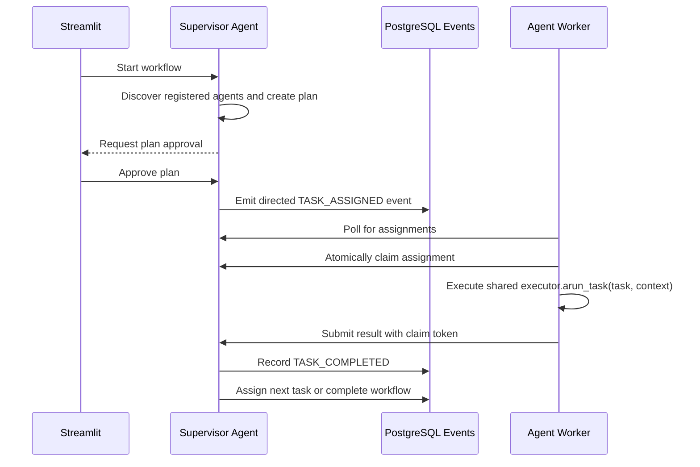

# Registry and Agent Dispatch

This note records how the orchestrator coordinates registered agents. The
orchestrator does not directly invoke the agent HTTP services during a workflow.
It creates directed assignments that always-running workers discover and process.

## Workflow Sequence

## Dispatch Flow

1. The supervisor discovers online agents from the registry by capability.
2. After plan approval, it emits `TASK_ASSIGNED` with a `target_agent`.
3. Each `AssignmentWorker` polls `GET /workers/{agent_id}/assignments`.
4. The selected worker claims the task through
   `POST /workers/{agent_id}/assignments/{event_id}/claim`.
5. The worker submits the task to the process's shared `AgentExecutor`, which calls
   `agent.arun_task(task, context)` under concurrency and thread-serialization limits.
6. The worker submits the result and claim token through
   `POST /workers/{agent_id}/assignments/{event_id}/result`.
7. `WorkerService` validates the claim and resumes the supervisor's LangGraph
   workflow.
8. The supervisor assigns the next planned task or completes the workflow.

PostgreSQL stores the event timeline, assignment claims, registry cards, and
LangGraph checkpoints. This allows workers to restart and recover unfinished
assignments without direct agent-to-agent calls.

`agentmesh_agents` holds stable identity and Agent Card data. Every `api`, `worker`,
or `combined` process has a separate `agent_runtime` row in `agentmesh_resources`.
The registry aggregates those rows: direct readiness requires a ready API-capable
instance, while assignment readiness requires a ready worker-capable instance.
Staleness is evaluated per process rather than against one shared timestamp.

## Direct Invocation

The agent `/invoke` endpoints on ports `8101` and `8102` are used by the Agent
Playground and independent agent tests. Normal orchestration uses registry
discovery, directed assignment events, polling, and atomic leases instead.
In split mode, API ports remain inside the Compose network so replicas can scale.

## Future MCP Boundary

The registry can later expose MCP tools for controlled agent discovery and
status inspection. That adapter should use the existing registry service and
must not replace assignment validation, leases, or the event log.
