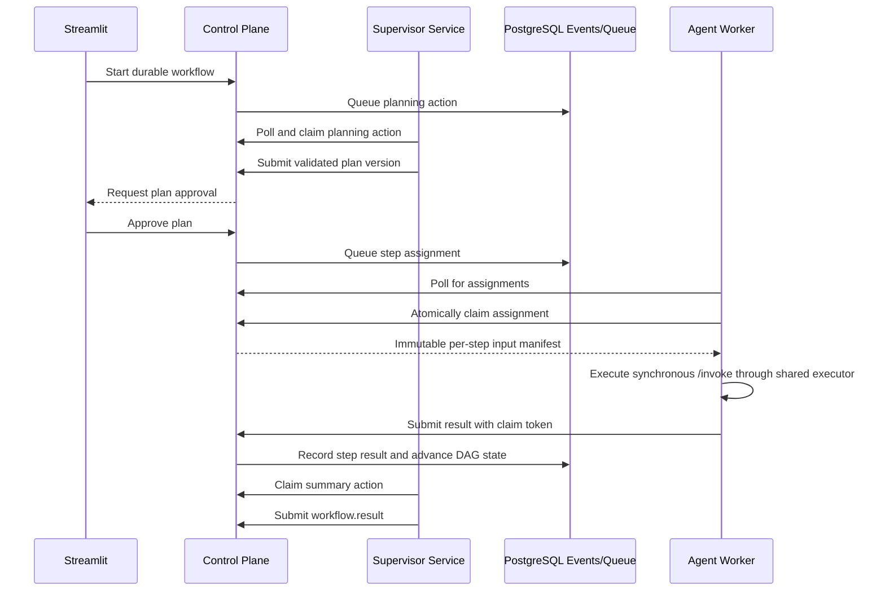

# Registry and Agent Dispatch

This note records how the durable registry/control plane coordinates registered
agents. The orchestrator is an independent supervisor service: it does not own
the queue and does not directly invoke agent HTTP services during a workflow. It
claims planning, validation, replan, and summary actions from the control plane.

## Workflow Sequence

## Dispatch Flow

1. The control plane stores Agent Cards, runtime presence, workflow state, and
   queue state in PostgreSQL.
2. The supervisor claims planning work and proposes a validated plan version.
3. After plan approval, the control plane queues step assignments with a target
   agent and immutable input manifest.
4. Each `AssignmentWorker` polls `GET /workers/{agent_id}/assignments`.
5. The selected worker claims the task through
   `POST /workers/{agent_id}/assignments/{event_id}/claim`.
6. The worker submits the manifest to the process's shared `AgentExecutor`, which
   calls `agent.arun_task(task, context)` under concurrency and thread-serialization
   limits.
7. The worker submits the result and claim token through
   `POST /workers/{agent_id}/assignments/{event_id}/result`.
8. `WorkerService` validates the claim, records the result, handles retry/dead-letter
   state, and advances DAG-ready work.
9. The supervisor later claims replan or summary work when semantic review or final
   synthesis is needed.

PostgreSQL stores the event timeline, assignment claims, registry cards, DAG state,
retry state, and LangGraph checkpoint mappings. This allows workers and the
supervisor to restart and recover unfinished work without direct agent-to-agent
calls.

`agentmesh_agents` holds stable identity and Agent Card data. Every `api`, `worker`,
or `combined` process has a separate `agent_runtime` row in `agentmesh_resources`.
The registry aggregates those rows: direct readiness requires a ready API-capable
instance, while assignment readiness requires a ready worker-capable instance.
Staleness is evaluated per process rather than against one shared timestamp.

Step dependencies are resolved by `workflow_id`, `plan_version`, stable `step_id`,
and named input bindings. The supervisor may inspect authorized workflow outputs,
but the control plane only includes the fields the supervisor selected in each
downstream worker manifest.

## Direct Invocation

The agent `/invoke` endpoints on ports `8101` and `8102` are used by Agent
Playground direct mode and independent agent tests. Agent Playground can also
submit durable direct work through the control plane. Normal workflows use
control-plane queueing, supervisor planning, directed assignment events, polling,
and atomic leases instead. In split mode, API ports remain inside the Compose
network so replicas can scale.

Transient worker failures such as 429, timeouts, and 502-504 responses are retried
by the control plane without waking the supervisor. Semantic failures create
checkpoint review or replan work. Long planning pauses use
`planning.input_requested` and `planning.input_provided`.

## Future MCP Boundary

The registry can later expose MCP tools for controlled agent discovery and
status inspection. That adapter should use the existing registry service and
must not replace assignment validation, leases, or the event log.
